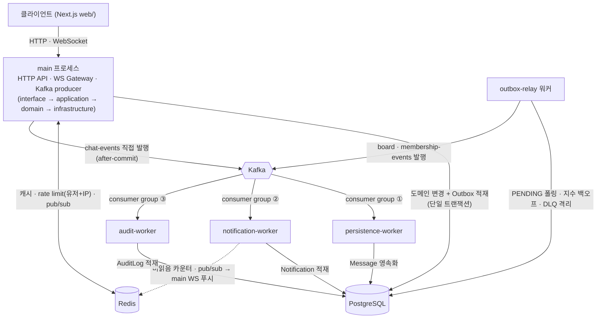

# estate-server — 건물주·입주자 커뮤니케이션 플랫폼

건물주와 입주자를 잇는 백엔드 플랫폼입니다. **Prisma · Redis · Kafka** 를 한 프로젝트 안에서 의미 있게 엮어 보며, 분산·이벤트 드리븐 백엔드 설계 역량을 쌓기 위한 개인 학습 프로젝트입니다.

`건물주(Owner) → 건물(Building) → 호실(Unit) → 입주(Lease)` 4계층 모델 위에서, 입주자는 **초대코드**로 호실에 연결되고 같은 건물 입주자끼리 **게시판**으로 소통하며 건물주와 **1:1 실시간 채팅·알림**을 주고받습니다.

> **레포 구성:** 백엔드(이 레포) + 프론트엔드 `web/`(Next.js, [estate-web](https://github.com/Jin-dev92/estate-web) **git 서브모듈**).
> **상태:** 설계 확정, 마일스톤 기반 구현 진행 — 상세 설계는 [설계 스펙 문서](docs/superpowers/specs/2026-06-11-building-owner-platform-design.md)에 있습니다.

<p align="center">
  
</p>

이 백엔드가 구동하는 화면입니다. 로그인 → 입주자 대시보드 → 게시판 → 게시글 → 1:1 채팅 → 알림 → 설정 → 건물주 대시보드 → 건물 관리 → 호실 관리 순서로 전환됩니다.
GIF는 `web/` 서브모듈([estate-web `docs/screenshots/`](https://github.com/Jin-dev92/estate-web/blob/main/docs/screenshots/screens.gif))을 참조합니다 — 단일 출처라 FE에서 화면을 갱신하면 여기도 함께 바뀝니다. 재생성 절차는 [estate-web `docs/guides/screenshots.md`](https://github.com/Jin-dev92/estate-web/blob/main/docs/guides/screenshots.md)에 있습니다.

---

## 한눈에 보기

**이 프로젝트가 증명하는 것**

- **이벤트 유실 없는 설계** — Transactional Outbox + DLQ(지수 백오프): 도메인 변경과 이벤트 적재를 한 트랜잭션으로 묶어 "DB엔 썼는데 이벤트는 유실" 창을 제거
- **진짜 팬아웃** — Kafka 컨슈머 워커 3종(persistence·notification·audit)을 독립 프로세스·독립 consumer group으로 분리해, 같은 이벤트를 서로 다른 관심사로 한 번씩 소비
- **측정 기반 접근** — k6 baseline/stress/spike로 병목(DB 커넥션 풀)을 숫자로 특정: 풀을 좁히자 p95 13.6ms → 1,734ms, throughput 천장 ~95 RPS
- **품질 게이트** — 단위테스트 225개 + CI 3중 게이트(경고 0 lint · Prisma 마이그레이션 drift 검사 · 자동 코드리뷰)



**30초 요약** — 클라이언트 요청은 main 프로세스가 받고, 도메인 변경과 이벤트 적재(Outbox)를 **한 트랜잭션**으로 커밋합니다. outbox-relay가 이를 Kafka로 발행하면 세 워커가 **각자 독립 consumer group**으로 팬아웃 소비합니다. 채팅은 지연에 민감해 **실시간 전달(Redis pub/sub)과 영속화(Kafka 컨슈머)를 분리**했고, 워커(별도 프로세스)의 알림 푸시는 Redis 채널로 main의 WS Gateway에 브리지됩니다.

---

## 빠른 시작

```bash
# 0) 클론 — FE는 web/ 서브모듈이므로 함께 받기
$ git clone --recurse-submodules https://github.com/Jin-dev92/estate-server-kafka.git
#   이미 클론했다면: git submodule update --init --recursive

# 1) 인프라(PostgreSQL·Redis·Kafka) 기동
$ docker compose up -d
$ docker compose up -d prometheus grafana   # 선택: Prometheus :9090, Grafana :3001

# 2) 의존성 설치 + 마이그레이션
$ pnpm install
$ pnpm exec prisma migrate deploy

# 3) main 프로세스 (HTTP API :3000 + WebSocket + Kafka producer)
$ pnpm start:dev

# 4) 워커 4종 — 각각 별도 터미널/프로세스
#    컨슈머 워커 3종은 각자 독립 consumer group으로 Kafka를 구독한다
$ pnpm start:worker:persistence    # chat-events → Message 적재
$ pnpm start:worker:notification   # chat+board-events → Notification + WS 푸시
$ pnpm start:worker:audit          # 전체 구독 → AuditLog
#    outbox-relay는 컨슈머가 아니라 DB의 PENDING 행을 폴링하는 producer다
$ pnpm start:worker:outbox         # PENDING OutboxEvent 폴링 → Kafka 발행
#   운영 빌드 후에는 start:prod / start:prod:persistence|notification|audit|outbox

# 테스트
$ pnpm test        # 단위 테스트
$ pnpm test:e2e    # e2e 테스트
$ pnpm test:cov    # 커버리지

# 프론트엔드(web/ = estate-web) — 백엔드와 별개 프로세스
$ cd web && pnpm install && pnpm dev

# 부하테스트 (k6) — load/README.md 참고
$ pnpm load:seed && PROFILE=load pnpm load:read
```

> 워커는 같은 코드베이스를 다른 엔트리포인트(`src/workers/*.main.ts`)로 띄운 별도 프로세스입니다. 서버 기동 후 **`/docs`**(Swagger UI)·**`/docs-json`**(OpenAPI JSON)에서 인터랙티브 API 문서를 볼 수 있습니다.
>
> 현재 main에는 비활성 `ChatPersistenceController`(microservice 미연결)가 남아 있으나, 영속화는 persistence-worker가 담당합니다(후속 정리 대상).

---

## 기술 스택

| 구분 | 기술 | 역할 |
|---|---|---|
| 런타임·프레임워크 | TypeScript, Node.js, NestJS | main(HTTP+WS+producer) + 컨슈머 워커 3종 + outbox-relay |
| 데이터 | PostgreSQL, Prisma | 관계형 모델링·마이그레이션·타입 안전 쿼리 |
| 캐시·실시간 | Redis, WebSocket(NestJS Gateway) | 캐시·TTL·원자적 카운터·rate limit·pub/sub, 1:1 채팅·알림 푸시 |
| 이벤트 | Apache Kafka (cp-kafka, KRaft) | 도메인 이벤트 발행 → 다중 컨슈머 팬아웃 |
| 아키텍처 | DDD | 바운디드 컨텍스트 + `interface → application → domain → infrastructure` |
| 품질 | Jest, ESLint, Prettier, k6 | 단위·e2e 테스트, 정적 검사, 부하 baseline |
| 관측성 | Sentry, prom-client, Prometheus, Grafana | 개별 에러 추적(Sentry) + 집계 시계열(metrics) |
| 프론트엔드 | Next.js 16(App Router), React 19, Tailwind v4 | `web/` 서브모듈 |

---

## API 레퍼런스

> API가 추가·변경되면 이 표와 PR 본문을 함께 갱신합니다(CLAUDE.md "API 문서화" 규칙). 모든 보호 엔드포인트는 `Authorization: Bearer <accessToken>` 헤더가 필요합니다. 요청·응답 스키마와 enum 허용값의 진실 원천은 **`/docs`(Swagger)** 이며, 아래는 요약입니다.

### Auth

| 메서드·경로 | 기능 | 인가 |
|---|---|---|
| `POST /auth/signup` | 회원가입(기본 역할 TENANT; `role` 선택적 — OWNER·TENANT만 허용, ADMIN 불가) | 공개 |
| `POST /auth/login` | 로그인, JWT `accessToken` + `refreshToken` 발급 | 공개 |
| `POST /auth/kakao` | 카카오 로그인(code 교환) — 기존 유저 `{accessToken, refreshToken}`, 신규 `{onboardingToken}`. 카카오 장애 시 `503 AUTH_KAKAO_UNAVAILABLE` | 공개 |
| `POST /auth/kakao/complete` | 카카오 신규 가입 완료(역할 선택) → `{accessToken, refreshToken}` | 공개(onboarding 토큰 보유) |
| `GET /auth/me` | 내 정보(id·email·role) 조회(토큰 기반, DB 미조회) | 인증 |
| `GET /auth/profile` | 프로필(id·email·name·role) 조회(DB) | 인증(본인) |
| `PATCH /auth/profile` | 프로필 이름 수정 | 인증(본인) |
| `PATCH /auth/password` | 비밀번호 변경(현재 비번 확인 + 새 비번 8자+) + 전체 세션 폐기 | 인증(본인) |
| `POST /auth/refresh` | 토큰 갱신(회전). 소비된 토큰 재제출 시 세션 전체 폐기 | 공개(리프레시 토큰 보유) |
| `POST /auth/logout` | 현재 세션 폐기(멱등) | 공개(리프레시 토큰 보유) |
| `POST /auth/logout-all` | 내 모든 세션 폐기 | 인증 |
| `GET /auth/sessions` | 내 활성 세션 목록(로그인 시각·`current`) | 인증(본인) |
| `DELETE /auth/sessions/:familyId` | 특정 세션 폐기(204) | 인증 + 세션 소유자 |

### Property

| 메서드·경로 | 기능 | 인가 |
|---|---|---|
| `POST /buildings` | 건물 생성 | OWNER |
| `GET /buildings` | 내 건물 목록 | OWNER |
| `POST /buildings/:buildingId/units` | 호실 생성 | OWNER(건물 소유자) |
| `POST /units/:unitId/invite-codes` | 초대코드 발급(Redis TTL 24h) | OWNER(건물 소유자) |
| `GET /invite-codes/:code/preview` | 초대코드 미리보기(코드 비소비, `{valid, buildingName?, unitName?}`) | 미인증 공개 |
| `POST /invite-codes/redeem` | 초대코드 사용 → 입주(Lease 생성) | 인증 |
| `GET /me/leases` | 내 입주(Lease) 목록 | 인증 |
| `PATCH /leases/:id/end` | 계약 종료 | 인증 + 건물 OWNER |

### Board

| 메서드·경로 | 기능 | 인가 |
|---|---|---|
| `POST /buildings/:buildingId/posts` | 게시글 작성 | 건물 멤버 |
| `GET /buildings/:buildingId/posts` | 게시글 목록(read-through 캐시, `likeCount`·`likedByMe` 포함) | 건물 멤버 |
| `GET /posts/:postId` | 게시글 상세 + 댓글(캐시, `likeCount`·`likedByMe` 포함) | 건물 멤버 |
| `PATCH /posts/:postId` | 게시글 수정 | 작성자 |
| `DELETE /posts/:postId` | 게시글 삭제(204, 댓글 cascade) | 작성자 |
| `POST /posts/:postId/comments` | 댓글 작성 | 건물 멤버 |
| `POST /posts/:postId/likes` · `DELETE /posts/:postId/likes` | 게시글 좋아요·취소(멱등) | 건물 멤버 |

> **건물 멤버** = 건물주이거나 그 건물 호실에 ACTIVE 입주(Lease)가 있는 사용자.
>
> **Rate limit:** 모든 쓰기 라우트는 전역 `RateLimitGuard`로 userId+IP 이중 제한(기본 user 60·IP 120/분). 스팸 표면이 큰 '생성' 라우트는 더 조인다 — `POST …/posts` = user 20·IP 30/분, `POST …/comments` = user 30·IP 60/분(`BOARD_RATE_LIMIT` 상수). 좋아요는 멱등·연타 허용이라 기본 한도. 초과 시 429(`RATE_LIMIT_EXCEEDED`) + `Retry-After`.

### Chat

| 메서드·경로 | 기능 | 인가 |
|---|---|---|
| `POST /chat/rooms` | 채팅방 생성/조회(ensure) | 인증 + 건물 OWNER 또는 본인-입주자 |
| `GET /chat/rooms` | 내 채팅방 목록 | 인증(본인이 참가자인 방) |
| `GET /chat/rooms/:id/messages` | 메시지 히스토리(최신순, 캐시 우선·DB 폴백) | 방 참가자 |
| WS `join` / `message` | 1:1 실시간 채팅(socket.io, 핸드셰이크 `auth.token` JWT) | 방 참가자 |

### Notification

| 메서드·경로 | 기능 | 인가 |
|---|---|---|
| `GET /notifications` | 내 알림 목록(최신순, `?limit=` 기본 50·최대 100, 딥링크용 `buildingId` 포함) | 인증(본인) |
| `GET /notifications/unread-count` | 미읽음 수(Redis 원자적 카운터) | 인증(본인) |
| `PATCH /notifications/read` | 전체 읽음 처리 + 카운터 리셋 | 인증(본인) |
| `PATCH /notifications/:id/read` | 단건 읽음 처리(+미읽음 카운터 감소, 멱등) | 인증(본인) |
| WS `/notifications` (`notification` 이벤트) | 실시간 알림 푸시(socket.io 네임스페이스, 핸드셰이크 `auth.token` JWT) | 본인(연결 시 `user:{userId}` 룸 자동 join) |

> 수신자 해석: 채팅=방 상대방, 댓글=글 작성자, 게시글=건물 멤버(작성자/발신자 제외).

### Observability

| 메서드·경로 | 기능 | 인가 |
|---|---|---|
| `GET /metrics` | Prometheus 형식의 RED·Outbox depth·Kafka consumer lag 조회 | **인증 없음** |

> `/metrics`는 애플리케이션 인증이 없으므로 운영망에서 **네트워크 수준 접근 제한이 필수**입니다.

### 에러 응답 형식

모든 4xx/5xx 에러는 전역 ExceptionFilter가 아래 봉투로 통일해 내려줍니다. **FE는 메시지 문구 대신 안정적인 `code`로 분기**합니다.

```json
{
  "statusCode": 404,
  "code": "BOARD_POST_NOT_FOUND",
  "message": "게시글을 찾을 수 없습니다.",
  "path": "/posts/abc123",
  "timestamp": "2026-06-12T08:00:00.000Z"
}
```

`code`의 진실 원천은 컨텍스트별 에러 정의 파일이며, 각 코드의 HTTP status와 메시지가 한곳에 선언되어 있습니다.

| 컨텍스트 | 파일 | 대표 코드 |
|---|---|---|
| Auth | [`src/auth/auth.errors.ts`](src/auth/auth.errors.ts) | `AUTH_EMAIL_IN_USE`(409) · `AUTH_INVALID_CREDENTIALS`(401) · `AUTH_KAKAO_UNAVAILABLE`(503) · `AUTH_REFRESH_TOKEN_REUSED`(401) · `AUTH_NOT_SESSION_OWNER`(403) |
| Property | [`src/property/property.errors.ts`](src/property/property.errors.ts) | `PROPERTY_NOT_BUILDING_OWNER`(403) · `PROPERTY_INVALID_INVITE_CODE`(404) |
| Board | [`src/board/board.errors.ts`](src/board/board.errors.ts) | `BOARD_POST_NOT_FOUND`(404) · `BOARD_NOT_BUILDING_MEMBER`(403) |
| Chat | [`src/chat/chat.errors.ts`](src/chat/chat.errors.ts) | `CHAT_ROOM_NOT_FOUND`(404) · `CHAT_NOT_ROOM_PARTICIPANT`(403) |
| Rate limit | [`src/common/rate-limit/rate-limit.errors.ts`](src/common/rate-limit/rate-limit.errors.ts) | `RATE_LIMIT_EXCEEDED`(429, `Retry-After` 헤더 포함) |
| 공통 | [`src/common/errors/`](src/common/errors) | `COMMON_VALIDATION_FAILED`(400) · `VALIDATION_FAILED`(422, 도메인 불변식 위반) · `COMMON_UNAUTHORIZED`(401) · `COMMON_INTERNAL_ERROR`(500) |

> 전체 목록을 README에 복사해 두지 않는 이유는 코드 추가 시 문서만 뒤처지기 때문입니다. 실제로 이전 README의 코드 표는 14개를 나열했으나 그 시점에 이미 10개(`CHAT_*` 4종, `PROPERTY_LEASE_*` 2종, `AUTH_*` 4종)가 누락된 상태였습니다.

---

## 마일스톤

각 단계는 독립적으로 동작 검증되도록 끊었고, 컨슈머는 난이도 순(audit → persistence → notification)으로 도입해 실패 비용을 점증시켰습니다. M0~M7이 1차 범위(핵심 기능·정합성·부하 baseline)이고, M8 이후는 그 위에 운영 견고함·관측성·측정 기반 성능 개선을 얹는 후속입니다.

| 단계 | 내용 · 학습 포커스 | 상세 |
|---|---|---|
| **M0** ✅ | docker-compose(PG·Redis·Kafka) + Prisma 스키마 + Auth(JWT) — Prisma 기초·마이그레이션 | [계획](docs/superpowers/plans/2026-06-12-m0-foundation-auth.md) |
| **M1** ✅ | 건물/호실/입주 + 초대코드 — Prisma 관계, Redis TTL | 학습 노트 §1·§2 |
| **M2** ✅ | 게시판 CRUD + Redis 캐싱 — 캐시 무효화 패턴 | 학습 노트 §2 |
| **M2.5** ✅ | 전역 에러 처리 + 일관 에러 봉투 — ExceptionFilter, 커스텀 예외 | [스펙](docs/superpowers/specs/2026-06-12-error-handling-design.md) |
| **M2.6** ✅ | Swagger(OpenAPI) 연동 — enum 명명 스키마 | [스펙](docs/superpowers/specs/2026-06-13-swagger-integration-design.md) |
| **M3** ✅ | Kafka 도입 + audit-worker — producer/consumer 첫걸음 | [스펙](docs/superpowers/specs/2026-06-14-m3-kafka-audit-design.md) |
| **M4** ✅ | 1:1 채팅 WS + Redis pub/sub + persistence-worker — WS+Redis+Kafka 통합 | [스펙](docs/superpowers/specs/2026-06-14-m4-chat-design.md) |
| **M5** ✅ | notification-worker + WS 푸시 + 미읽음 카운트 — 다중 컨슈머 팬아웃 | [스펙](docs/superpowers/specs/2026-06-15-m5-notification-design.md) |
| **M6** ✅ | rate limit · 보안 점검 — 운영·보안 | [스펙](docs/superpowers/specs/2026-06-15-m6-rate-limit-design.md) |
| **Outbox** ✅ | Transactional Outbox + outbox-relay — 트랜잭션 정합·SKIP LOCKED·at-least-once | [스펙](docs/superpowers/specs/2026-06-16-outbox-design.md) |
| **M7** ✅ | k6 부하테스트(대표 4개 + thresholds) — 성능 baseline·p95/p99 | [스펙](docs/superpowers/specs/2026-06-16-m7-load-test-design.md) · 학습 노트 §8.5 |
| **M8** ✅ | stress/spike 한계 탐색 — k6 arrival-rate·병목(DB 풀)·용량 계획 | [스펙](docs/superpowers/specs/2026-06-17-m8-stress-spike-load-design.md) · 학습 노트 §8.5 |
| **M9** ✅ | Outbox 견고화: DLQ(FAILED 격리)·재시도 백오프 — poison message·지수 백오프 | [스펙](docs/superpowers/specs/2026-06-17-m9-outbox-dlq-design.md) · 학습 노트 §8 |
| **M10** ✅ | Sentry 에러 추적 + 성능 모니터링 — PII 스크러빙·외부 SaaS 의존 | [스펙](docs/superpowers/specs/2026-06-17-m10-sentry-design.md) · 학습 노트 §8.6 |
| **M10.5** ✅ | 분산 트레이싱: HTTP→Outbox→Kafka→워커 trace 전파 — Kafka 헤더 캐리어 | [스펙](docs/superpowers/specs/2026-07-04-distributed-tracing-design.md) · 학습 노트 §8.9 |
| **M11** ✅ | 좋아요 카운터 Redis 전환 + k6 전후 측정 — 파생 캐시·drift/TTL 치유·통제 실험 | [실측](load/results/m11-like-counter.md) · 학습 노트 §8.7 |
| **M12** ✅ | 회복탄력성: 카카오 OAuth 재시도·서킷 브레이커·벌크헤드·총 시간 예산 — fail-fast·정책 조합 순서 | [실측](load/results/m12-resilience.md) · 학습 노트 §8.10 |
| **M13** ✅ | 그레이스풀 셧다운: 5개 프로세스 SIGTERM 드레인 — in-flight 유실 0·Kafka graceful leave | [실측](load/results/m13-graceful-shutdown.md) · 학습 노트 §8.11 |
| **M14** ✅ | 메트릭 대시보드: Prometheus + Grafana — RED·consumer lag·Outbox depth | [실측](load/results/m14-metrics.md) · [스펙](docs/superpowers/specs/2026-07-21-m14-metrics-dashboard-design.md) |
| **CI** 🟡 | PR 게이트(build·typecheck + Prisma drift + lint·단위 테스트) + 수동 버전 범프 + 자동 PR 리뷰 | 학습 노트 §8.8 |
| **F1** ✅ | OAuth 소셜 로그인(카카오) — code 교환·Account 모델·우리 JWT 발급 | [스펙](docs/superpowers/specs/2026-06-22-onboarding-design.md) |
| **F2** *(추후)* | 채팅 메시지 자동 번역(외국인 입주자 대응) — 외부 API 어댑터·i18n | — |

---

## 설계 결정

모든 설계는 "왜 그렇게 했는가"를 근거와 트레이드오프로 남겼습니다. 각 결정의 대안 비교와 깊은 맥락은 [설계 스펙 문서](docs/superpowers/specs/2026-06-11-building-owner-platform-design.md)에 있습니다.

| # | 결정 | 근거 | 트레이드오프 |
|---|---|---|---|
| 1 | 도메인을 `건물 → 호실 → 입주` 3계층으로 | 호실 단위 점유·소통("특정 호실에만 보이는 공지")을 표현할 수 있다 | 모델이 무거워지지만 그 무게가 곧 Prisma 관계 학습 표면적 |
| 2 | 입주 연결은 초대코드 방식 | 신청/승인 상태머신 없이 단순하고, Redis TTL 학습과 `TenantJoined` 이벤트 소스를 확보 | 코드 분실·재발급 흐름을 따로 다뤄야 함 |
| 3 | 게시판: 건물 단위 + read-through 캐시 + 쓰기 시 명시적 무효화 | 읽기 ≫ 쓰기인 전형적 read-heavy 영역이라 캐시 효과가 분명 | 캐시 일관성 관리 비용 → 명시적 무효화 + 짧은 TTL 안전망 |
| 4 | 채팅: 실시간 전달(Redis pub/sub) ↔ 영속화(Kafka) 분리 | 체감 지연을 낮추고, Kafka를 쓰기 버퍼로 두어 스파이크 흡수 | "전달은 됐는데 DB엔 아직" 창이 생김. 순서는 `roomId` 파티션 키로 보장 |
| 5 | 알림은 인앱+WS만, 외부 푸시(FCM) 제외 | 키 발급·구독 관리가 학습 본질(Kafka→Redis→WS)을 흐린다 | 브라우저를 닫으면 도달 불가 → 상용화 시 FCM 소비자 하나만 추가하면 되는 구조 |
| 6 | Kafka 토픽 3분할 + 다중 컨슈머 그룹 팬아웃 | 이벤트 1건을 persistence·notification·audit이 독립 소비하는 팬아웃이 핵심 학습 목표 | at-least-once라 멱등 소비자(메시지 ID upsert)가 필수 |
| 7 | DDD 레이어드 + 의존성 역전 | 컨텍스트=모듈 경계라 컨텍스트 간 통신이 도메인 이벤트로 자연스럽게 풀린다 | 보일러플레이트 증가 → 레이어 두께를 컨텍스트 복잡도에 비례 |
| 8 | DB-레벨 RLS 대신 앱 계층 인가(가드) | Prisma+Postgres 직접 사용이라 RLS 비적용. RBAC + 리소스 소유권 검사로 동등 보장 | 가드 누락이 곧 보안 구멍 → "다른 건물 데이터 우회 경로"를 명시적으로 점검 |
| 9 | 논리삭제: 5개 엔티티에 `deletedAt`, Lease는 제외 | 데이터 복구 + 부모 삭제 시 하위 이력 보존. Lease는 `status`로 이미 종료를 표현 | Post soft delete 시 자식 Comment를 같은 트랜잭션에서 함께 soft delete. [상세·미해결 이슈](docs/superpowers/specs/2026-06-13-soft-delete-design.md) |
| 10 | 이벤트 발행 추상화는 application 직접 발행(`EventPublisher` 포트) | 도메인이 Kafka를 모르게 한다 | after-commit 단순 발행이라 유실 창이 있었음 → 결정 13으로 해소 |
| 11 | 워커별 엔트리포인트로 컨슈머 그룹 분리 | NestJS hybrid는 `@EventPattern`이 전역 등록되어 그룹별 분리가 어렵다 → 워커마다 별도 부트스트랩 | 프로세스가 5개로 늘지만 실제 배포 단위(워커=독립 배포·스케일)와 1:1 |
| 12 | 알림 푸시는 best-effort(적재·카운터가 진실 원천) | 푸시 실패가 알림 유실이 되면 안 된다 | 1:N(`PostCreated`) 알림은 동기 생성이라 대량 건물은 배치/비동기화가 후속 과제 |
| 13 | Transactional Outbox — 도메인 변경 + 이벤트 적재를 한 트랜잭션으로 | dual-write("DB는 썼는데 이벤트 유실")를 제거. relay가 `SELECT … FOR UPDATE SKIP LOCKED`로 잠그며 발행. **board·membership 4종에만 적용**하고 chat은 지연 최소화를 위해 직접 발행을 유지 | 폴링 주기만큼 지연이 더해짐(정합성↔지연). 중복 발행은 소비자 멱등이 흡수 = **at-least-once**. chat 경로에는 여전히 유실 창이 남음 |

---

## 부하테스트 결과

> 로컬 단일 머신(앱+PG+Redis+Kafka 동시 구동) 기준 — 절대치가 아니라 **상대 비교·회귀 감지**용. 실행법·전체 표·해석은 [`load/README.md`](load/README.md)와 [`load/results/`](load/results), 개념 정리는 [학습 노트 §8.5](docs/study/마일스톤-학습-노트.md).

| 시나리오 | 프로파일 | p95 | 에러율 | 무엇을 보나 |
|---|---|---|---|---|
| `GET /buildings/:id/posts` | load 20VU | **6.9ms** | 0% | Redis read-through 캐시 읽기(모든 VU가 같은 building → hit ~100%, 최상 시나리오) |
| `POST /buildings/:id/posts` | load 20VU | **19.6ms** | 0% | DB+Outbox 한 트랜잭션 쓰기 |
| `POST /auth/login` (순수) | smoke 1VU | **114ms** | 0% | bcrypt 검증 = CPU 바운드(읽기의 ~17배) |
| rate-limit 경계 | iter 20 | — | — | ipMax=10 → 429 관측 10회(한도 정확) |
| `POST .../posts` **stress**(풀=1) | ramping 10→600 RPS | **1734ms** | 0.23% | DB 커넥션 풀 고갈(P2024 35건), throughput 천장 ~95 RPS |
| `POST .../posts` **spike** | 5→300→5 RPS | **10ms** | 84%\* | 급증분 429 차단 4032·통과 743·5xx 0(앱 생존) |
| `GET .../posts` 좋아요 집계 | load 20VU, 글 50×좋아요 2000 | COUNT **73.46ms** → Redis 카운터 **13.27ms** | 0% | 파생 카운터 캐시 전후 비교 |

\* 84%는 의도된 방어(429)이지 실패가 아닙니다. 로컬은 머신이 먼저 한계라, stress는 DB 풀을 1로 좁혀 *앱이 먼저* 터지게 한 통제 실험으로 진행했습니다.

---

## 더 보기

- 📄 **[전체 설계 스펙 문서](docs/superpowers/specs/2026-06-11-building-owner-platform-design.md)** — 도메인 모델, 기능별 설계, Kafka 토픽/컨슈머, DDD 레이어 구조
- 📒 **[마일스톤 학습 노트](docs/study/마일스톤-학습-노트.md)** — 마일스톤별 "왜 그렇게 했는가"·트레이드오프·스스로 점검
- 📖 **[용어집](docs/study/용어집.md)** — DDD·Redis·Kafka·정합성·부하테스트 용어를 카테고리별로
- 🧪 **[부하테스트 가이드](load/README.md)** · **[실측 리포트](load/results)** — 실행법과 M11~M14 측정 기록
