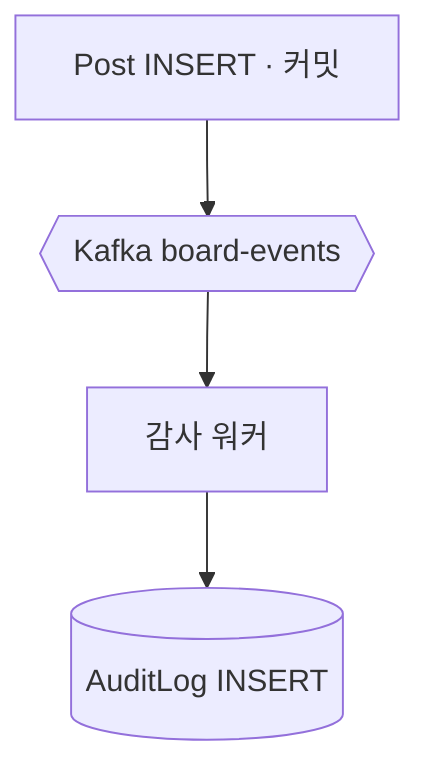
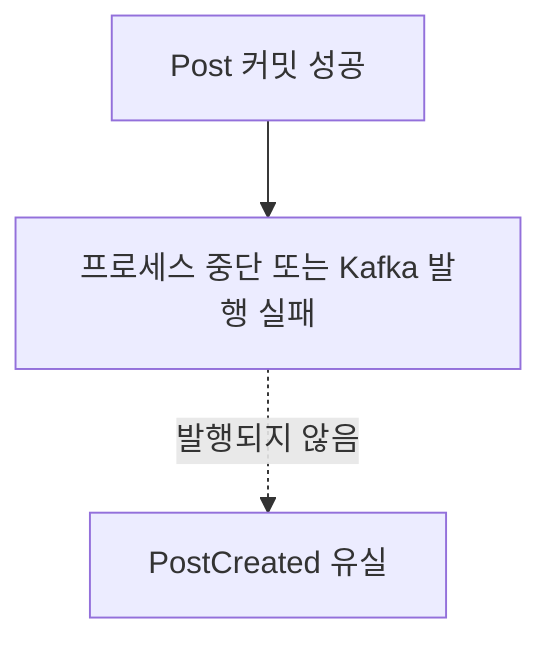
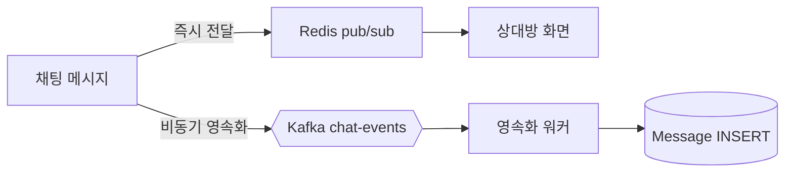
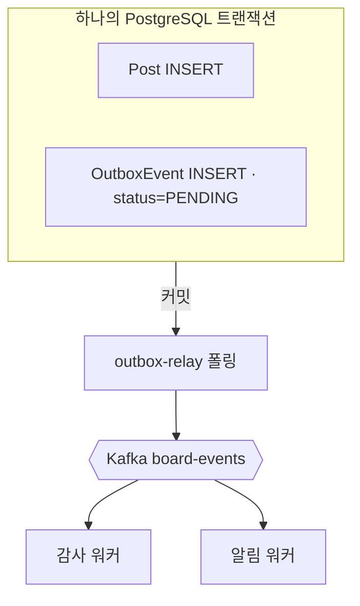
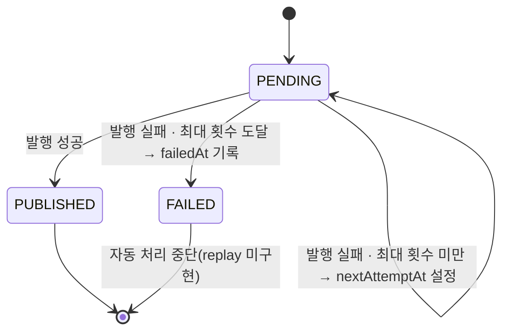

# 게시글 작성의 정합성 경계를 다시 그린 과정 — Kafka, Outbox, DLQ의 선택과 한계

게시판과 채팅을 함께 가진 백엔드 서비스에서 게시글 작성 한 건의 정합성 경계를 단계적으로 바꾼 과정을 정리한 글입니다.
초기 방식은 DB 커밋 뒤 메시지 브로커인 Kafka에 직접 발행했습니다. 작업 분리에는 충분했지만, 두 시스템 사이의 실패를 원자적으로 다루지 못했습니다.

## TL;DR

- 첫 단계에서는 DB 커밋 뒤 실행하는 after-commit 직접 발행과, 중복에도 결과를 같게 유지하는 소비자 멱등성을 선택했습니다.
- DB 변경과 발행 의도를 함께 저장하는 Outbox는 정합성을 우선한 게시판·입주 및 계약의 5개 경로에만 적용했고, 지연이 중요한 채팅은 직접 발행을 유지했습니다.
- 실패 처리에는 실패할수록 간격을 늘리는 지수 백오프와 `FAILED` 격리를 적용했지만, 격리 이벤트를 되돌리는 replay와 보존 정책은 후속 과제로 남겼습니다.

## 한 건의 게시글이 드러낸 문제

게시글 작성은 하나의 사용자 요청이지만, 시스템에서는 세 가지 결과로 이어집니다.

```text
1. Post 저장
2. PostCreated 발행
3. 감사 로그와 수신자별 알림 생성
```

**도메인 이벤트(domain event)**는 비즈니스에서 이미 발생한 사실을 표현한 메시지입니다. `PostCreated`는 게시글 저장 뒤 필요한 후속 처리를 원 요청에서 분리합니다.

핵심 질문은 “Kafka를 쓸 것인가”가 아니었습니다. Post 저장과 `PostCreated` 발행 중 어느 범위까지를 하나의 성공으로 볼 것인지가 판단의 중심이었습니다.

## 결정 1: 직접 발행의 한계를 숨기지 않았습니다

첫 선택은 DB 커밋 뒤 `PostCreated`를 Kafka에 직접 발행하는 방식이었습니다.

**Kafka**는 producer가 토픽에 발행한 메시지를 consumer가 비동기로 처리하게 하는 메시지 브로커입니다. **producer**는 발행자, **consumer**는 처리자입니다.



이 선택은 작은 범위에서 producer–consumer 왕복과 감사 적재를 검증하기에는 단순했습니다. 도메인은 `EventPublisher` 포트에만 의존하고 Kafka 구현을 몰랐습니다. 같은 이벤트가 다시 전달될 가능성은 `AuditLog.eventId`의 unique 제약으로 흡수했습니다.

**at-least-once**는 메시지가 최소 한 번 전달되도록 시도하지만 중복 전달을 허용하는 방식입니다. **멱등성(idempotency)**은 같은 작업을 반복해도 최종 결과가 한 번 수행한 것과 같아지는 성질입니다.

대신 실패 경계가 분명했습니다.



**dual-write**는 하나의 논리적 작업이 DB와 메시지 브로커처럼 서로 다른 저장소를 각각 갱신하는 방식입니다. 이 직접 발행은 두 쓰기를 원자적으로 묶지 못했습니다. 당시에는 Outbox를 동시에 도입하지 않고, 이 유실 창을 명시적인 후속 과제로 분리했습니다.

| 선택지 | 당시 장점 | 당시 비용 | 판단 |
|---|---|---|---|
| 동기 후속 처리 | 원 요청에서 성공·실패 확인이 쉬움 | 감사·알림 지연과 장애가 게시글 요청에 전파 | 선택하지 않음 |
| after-commit 직접 발행 | 구현이 작고 Kafka 왕복 학습에 집중 가능 | DB 커밋 뒤 이벤트 유실 가능 | 첫 단계에서 선택 |
| 처음부터 Outbox | DB 변경과 발행 의도를 원자적으로 저장 | 트랜잭션 전파·전달 워커·주기적 조회까지 범위 확대 | 별도 단계로 분리 |

## 결정 2: 채팅에서는 정합성보다 체감 지연을 앞에 뒀습니다

채팅 경로는 같은 직접 발행을 영속화 버퍼로 확장했습니다. 화면 전달은 Redis pub/sub, DB 저장은 Kafka 뒤 영속화 워커가 담당합니다.

**파티션 키(partition key)**는 Kafka가 메시지를 넣을 파티션을 정하는 값입니다. 채팅은 `roomId`를 키로 사용해 같은 방의 메시지를 같은 파티션에 배치합니다.



**결과적 정합성(eventual consistency)**은 데이터가 즉시 일치하지 않더라도 시간이 지나 같은 상태로 수렴하는 성질입니다. 이 결정은 “전달은 됐지만 DB에는 아직 없는” 결과적 정합성 구간을 만듭니다. 발행 자체가 실패할 수 있는 창도 남습니다. 채팅 전송 유스케이스는 실패를 로깅하고 삼키는 `publish()`를 사용하며, Outbox relay 전용 `publishOrThrow()`를 사용하지 않습니다.

다만 직접 발행 실패로 이벤트 자체가 유실되면 수렴을 보장할 수 없으므로, 채팅 경로의 보장은 제한적입니다.

채팅에 Outbox를 적용하지 않은 것은 누락이 아니라 범위 결정입니다. Redis의 즉시 전달이 주 경로이고 Kafka는 비동기 영속화 경로입니다. Outbox 폴링을 추가하면 체감 지연과 흐름 복잡도가 늘어납니다. 이 시스템은 그 비용 대신 채팅의 유실 창을 수용했습니다.

## 결정 3: Outbox는 정합성 우선 경로에 선택적으로 적용했습니다

**Transactional Outbox**는 도메인 변경과 발행할 이벤트를 같은 DB 트랜잭션에 저장하고, 별도 relay가 나중에 브로커로 전달하는 패턴입니다. **relay**는 대기 중인 Outbox 행을 읽어 Kafka로 옮기는 워커입니다.

Outbox는 다음 5개 경로에 적용했습니다.

| 영역 | 유스케이스 | 이벤트 |
|---|---|---|
| 게시판 | 게시글 작성 | `PostCreated` |
| 게시판 | 댓글 작성 | `CommentCreated` |
| 게시판 | 좋아요 생성 | `LikeCreated` |
| 입주 | 초대코드 사용 | `TenantJoined` |
| 계약 | 계약 종료 | `LeaseEnded` |

게시글 작성 한 건에서는 원자성 경계가 다음처럼 바뀝니다.

```text
1. DB 트랜잭션 시작
2. Post INSERT
3. OutboxEvent INSERT(status=PENDING)
4. 함께 커밋
5. outbox-relay가 PENDING 조회
6. Kafka board-events에 PostCreated 발행
7. OutboxEvent를 PUBLISHED로 변경
```



이 시스템에는 영속화·감사·알림 역할의 consumer group이 있습니다. **consumer group**은 같은 group 안에서 파티션을 분담하고, 다른 group에는 같은 메시지를 독립적으로 전달하는 Kafka의 소비 단위입니다.

**postfix**는 이름 뒤에 붙는 접미사입니다. NestJS `ServerKafka`는 설정한 group 이름에 기본 `-server` postfix를 붙일 수 있으므로 브로커에 등록된 실제 이름을 확인해야 합니다. `PostCreated`가 실리는 `board-events`는 감사와 알림 group만 구독하며, 영속화 group은 `chat-events` 전용입니다.

### 멀티 relay의 경합 제어

relay의 `fetchPending`은 트랜잭션 안에서 `FOR UPDATE SKIP LOCKED`를 사용합니다.

```sql
SELECT id, "eventId", "eventType", topic, "partitionKey", payload, attempts, "traceContext"
FROM "OutboxEvent"
WHERE status = 'PENDING'
  AND ("nextAttemptAt" IS NULL OR "nextAttemptAt" <= now())
ORDER BY "createdAt" ASC
LIMIT :limit
FOR UPDATE SKIP LOCKED;
```

한 relay가 잠근 행을 다른 relay가 기다리지 않고 건너뛰게 해 동시 처리를 줄이는 선택입니다. 대신 Kafka 발행이 이 DB 트랜잭션 안에서 수행되므로, 브로커 응답이 느리면 트랜잭션과 행 잠금도 길어질 수 있습니다.

### 유실 제거와 중복 제거를 분리했습니다

Outbox가 보장하는 것은 “Post만 커밋되고 발행 의도는 사라지는 상태”의 제거입니다. Kafka 발행 성공 뒤 `PUBLISHED` 마킹 전에 relay가 중단되면 같은 이벤트가 다시 발행될 수 있습니다.

따라서 Outbox와 소비자 멱등 처리는 한 쌍입니다.

| 소비 결과 | 유니크 키 | 중복 흡수 방식 |
|---|---|---|
| `AuditLog` | `eventId` | `P2002` 무시 |
| `Message` | 애플리케이션 생성 `id` | 같은 `messageId`의 `P2002` 무시 |
| `Notification` | `[eventId, recipientId]` | 중복 수신자의 저장·카운터·푸시 생략 |

한 가지 `eventId` 규칙으로 모든 소비자를 일반화하지 않았습니다. 저장 결과의 의미에 따라 메시지는 자체 ID, 알림은 이벤트와 수신자의 복합 키가 필요했습니다.

## 결정 4: 무한 재시도를 운영 가능한 실패로 바꿨습니다

초기 Outbox의 성공 기준은 dual-write 유실 제거였습니다. 발행 실패 행은 `PENDING`에 남아 다음 폴링에서 다시 처리됐습니다. 일시적인 Kafka 장애에는 충분했지만, 영구 실패가 매 폴링의 자원과 로그를 계속 사용했습니다.

**poison message**는 스키마 불일치나 영구 오류로 재시도해도 계속 실패하는 메시지입니다.

**지수 백오프(exponential backoff)**는 실패 횟수에 따라 재시도 간격을 늘리는 전략입니다. 현재 공식은 `min(baseMs × 2^attempts, capMs)`입니다.

**DLQ(Dead Letter Queue)**는 반복 실패 메시지를 정상 흐름에서 격리해 사후 조사를 기다리게 하는 영역입니다. 이 구현은 별도 Kafka 토픽 대신 `OutboxEvent`의 `FAILED` 상태를 사용합니다.



기본 설정은 최대 5회, base 1초, cap 60초입니다. 첫 네 번의 실패 뒤 1초, 2초, 4초, 8초를 기다리고, 다섯 번째 실패에서 `FAILED`로 전환합니다. 기본 최대 횟수에서는 60초 cap에 닿지 않습니다.

| 상태·컬럼 | 판단에 제공하는 정보 |
|---|---|
| `PENDING` | 최초 발행 또는 재시도 대기 |
| `PUBLISHED`, `publishedAt` | 발행 완료와 완료 시점 |
| `FAILED`, `failedAt` | 자동 처리 중단과 격리 시점 |
| `attempts`, `nextAttemptAt` | 재시도 횟수와 다음 처리 가능 시각 |
| `lastError` | 마지막 실패 원인 |
| `eventId`, `eventType`, `topic`, `partitionKey`, `payload` | 재현과 재처리에 필요한 이벤트 정보 |
| `traceContext` | 원 요청과 지연 발행 trace의 연결 정보 |

이 선택은 자동 처리의 자원 상한을 만들지만, 실패를 해결하지는 않습니다. `FAILED` 행을 다시 `PENDING`으로 돌리는 replay 기능은 현재 없습니다. 격리 뒤의 조사·수정·재처리는 운영 절차로 남아 있습니다.

| 재시도 전략 | 장점 | 단점 |
|---|---|---|
| 고정 간격 무한 재시도 | 구현이 단순하고 복구 가능성을 계속 보존 | 영구 실패가 자원과 로그를 무기한 사용 |
| 지수 백오프만 적용 | 지속 장애의 호출 빈도를 낮춤 | poison message를 자동 처리 흐름에서 제거하지 못함 |
| 지수 백오프 + `FAILED` 격리 | 정상 흐름을 보호하고 조사 근거를 보존 | replay와 운영 대응이 별도로 필요 |

## 정량 검증에서 확인된 것과 확인하지 못한 것

로컬 통제 실험은 outbox-relay를 중지한 뒤 게시글 작성 요청 62건을 성공시켰습니다. 이때 `PENDING`은 최대 60까지 증가하고 `FAILED`는 0을 유지했습니다. relay 재시작 뒤에는 약 7초 안에 `PENDING`이 0으로 줄었습니다.

이 수치는 relay 중단 중 발행 의도가 DB에 축적되고, 재개 뒤 소진되는 동작을 확인합니다. 성공 요청 수와 peak가 다른 것은 수집 시점이 있는 지표의 관측값이기 때문이며, 이벤트 유실률을 직접 계산한 결과로 해석하지 않았습니다.

검증의 한계도 있습니다.

- 실험은 애플리케이션·PostgreSQL·Redis·Kafka를 함께 실행한 로컬 단일 머신 기준입니다.
- poison message를 장시간 부하에서 격리하는 처리량 비교 수치는 측정하지 않았습니다.
- 프로덕션 규모의 relay 수, 파티션 수, 복제 구성에서 처리량과 잠금 경합을 측정하지 않았습니다.
- `PUBLISHED` 행 아카이빙·삭제와 `FAILED` replay는 구현되지 않았습니다.
- 채팅 직접 발행 경로의 유실 창은 Outbox로 해소되지 않았습니다.

## 선택의 기준

이 여정에서 일관된 기준은 패턴의 일괄 적용이 아니라 실패 비용에 따른 경계 설정입니다.

| 경로 | 우선한 것 | 수용한 비용 |
|---|---|---|
| 채팅 | 화면 전달 지연 최소화 | Kafka 직접 발행 실패와 전달–DB 불일치 창 |
| 게시글·댓글·좋아요·입주·계약 종료 | 도메인 변경과 후속 이벤트의 정합성 | Outbox 폴링 지연과 relay 운영 복잡도 |
| Outbox 실패 처리 | 정상 이벤트 흐름 보호 | `FAILED` 이후 사람 중심의 복구 절차 |

**exactly-once**는 논리적 메시지 하나가 중복 효과 없이 정확히 한 번만 처리되는 보장입니다. Transactional Outbox는 exactly-once를 제공하지 않습니다. DB와 발행 의도를 원자적으로 묶고, at-least-once 중복은 소비자 멱등성에 맡기는 조합입니다. DLQ 역시 실패를 없애지 않고 자동 처리에서 분리할 뿐입니다.

실무에서는 유실 비용, 허용 지연, 중복 흡수 키, replay 절차, 보존 정책을 함께 결정해야 합니다. 이 항목 가운데 하나라도 빠지면 Outbox 도입은 정합성 패턴이 아니라 새로운 운영 대기열을 추가하는 데 그칠 수 있습니다.
