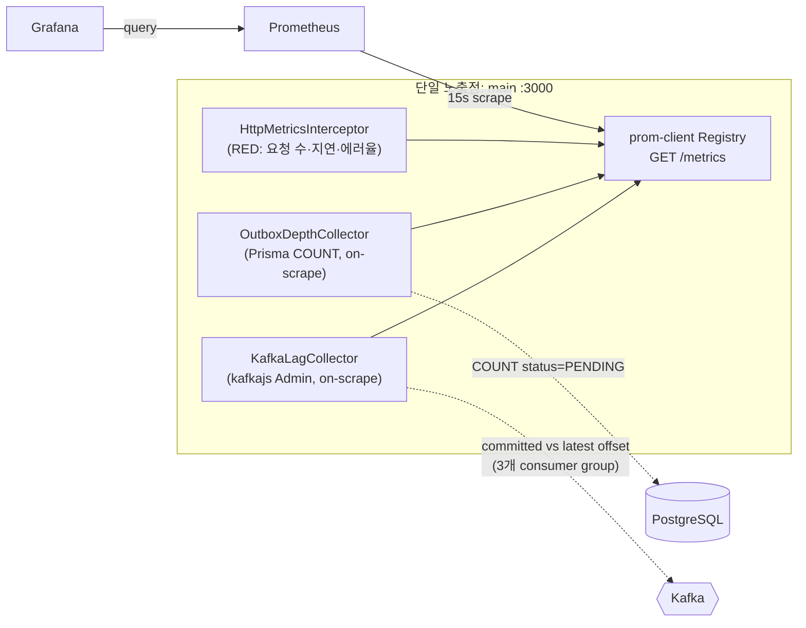

# M14 — 메트릭 대시보드(Prometheus + Grafana) 설계

> 작성일: 2026-07-21  
> 상태: 설계 확정(구현 대기)  
> 선행: M10(Sentry), M13(그레이스풀 셧다운)

---

## 1. 배경과 문제

**관측성(observability)**은 시스템 외부에 드러난 신호를 바탕으로 내부 상태를 파악하는 능력이다.

**Sentry**는 개별 에러와 요청 성능을 추적하는 관측성 서비스이다.

현재 관측성 수단은 M10에서 도입한 Sentry뿐이다. Sentry는 에러의 호출 경로인 스택 트레이스와 요청을 구성하는 작업 단위인 스팬의 흐름을 추적하지만, 시스템 전체의 상태를 시간에 따라 집계해 보여 주지는 않는다.

**집계 시계열(aggregated time series)**은 시간 축을 기준으로 여러 관측값을 모아 표현한 데이터이다.

이 프로젝트의 주요 운영 위험은 에러뿐 아니라 처리 적체이다. outbox-relay가 느려지면 `OutboxEvent`의 PENDING 행이 쌓여 이벤트 발행이 지연된다.

**컨슈머 지연(consumer lag)**은 브로커에 기록됐지만 컨슈머 그룹이 아직 소비하지 못한 메시지의 양이다.

Kafka 컨슈머가 뒤처지면 consumer lag이 증가한다. 두 적체는 예외를 발생시키지 않을 수 있으므로 Sentry만으로 탐지하기 어렵다. 조용히 악화되는 상태를 확인하려면 집계 시계열이 필요하다.

## 2. 목표와 범위

**Prometheus**는 시계열 메트릭을 주기적으로 수집하고 저장하는 시스템이다. **Grafana**는 시계열 데이터를 패널과 대시보드로 시각화하는 도구이다.

`prom-client`는 Node.js 애플리케이션에서 Prometheus 형식의 메트릭을 계측하는 라이브러리이다.

M14는 `prom-client`로 다음 세 신호를 `/metrics` 엔드포인트에 노출한다. Prometheus가 이를 주기적으로 수집하고 Grafana가 대시보드로 표현한다.

- **RED 메트릭**: Rate(요청 수), Errors(에러율), Duration(지연 분포)으로 서비스 상태를 나타내는 세 지표이다.
- **Kafka consumer lag**: 컨슈머 그룹별 처리 지연량이다.
- **Outbox PENDING depth**: 아직 발행되지 않은 `OutboxEvent`의 개수이다.

핵심 학습 목표는 Sentry와 메트릭의 역할을 구분하는 데 있다. 메트릭은 에러 없이 누적되는 적체를 보여 주고, Sentry는 개별 예외의 원인을 추적한다. 두 수단은 대체 관계가 아니라 상호 보완 관계이다.

§8의 통제 실험은 이 차이를 검증한다. 또한 요청 지연 분포를 히스토그램 버킷으로 상시 집계하여 M7의 일회성 k6 측정을 지속적인 관측으로 확장한다.

## 3. 핵심 설계 결정 — main 단일 노출점

**풀 모델(pull model)**은 수집기가 대상 시스템의 엔드포인트를 주기적으로 호출해 데이터를 가져오는 방식이다. Prometheus는 HTTP로 `/metrics`를 수집하는 풀 모델을 사용한다.

M13 설계에 따라 컨슈머 워커 4종(persistence, audit, notification, outbox-relay)은 HTTP 포트를 열지 않는다. `src/workers/*.main.ts`에서 `listen()`을 호출하지 않기 때문이다. 메트릭 노출 방식은 다음 두 가지이다.

| 방식 | 내용 | 트레이드오프 |
|---|---|---|
| **A. main 단일 노출점(채택)** | main만 `/metrics`를 열고 세 종류의 메트릭을 모두 노출한다. lag은 브로커의 committed offset을 외부에서 읽고, PENDING은 공유 DB에서 집계한다. 워커 4종은 수정하지 않는다. | 워커별 CPU·메모리 메트릭을 얻지 못한다. 워커 상태는 lag과 PENDING으로 간접 관측한다. |
| B. 프로세스별 노출점(5개 타깃) | main과 워커 4종이 각각 작은 HTTP 서버를 열고 Prometheus가 다섯 타깃을 수집한다. | HTTP가 없던 워커에 서버를 추가하므로 M13 설계와 충돌한다. 종료 배선과 수집 타깃도 늘어나 변경 범위가 커진다. |

방식 A를 채택한다. consumer lag은 컨슈머 외부에서 committed offset과 latest offset을 비교해 산출하므로 워커를 수정할 필요가 없다. PENDING 역시 공유 DB의 `COUNT`로 main에서 관측할 수 있다.

이 방식으로 lag과 PENDING을 건강 지표로 관찰하는 M14의 목표를 달성하면서 M13의 "HTTP 없는 워커" 설계를 유지한다. 워커별 프로세스 메트릭은 M14 범위에서 제외한다.

### 3.1 아키텍처

**스크레이프(scrape)**는 Prometheus가 대상 엔드포인트를 호출해 메트릭을 수집하는 작업이다.

## 4. 구성 요소 — `src/metrics/` 모듈

메트릭 기능은 기존 마일스톤 모듈인 `src/outbox/`와 같이 자기완결적인 모듈로 구성한다. `MetricsModule`은 `AppModule`에서만 가져오므로 메트릭 코드는 main에서만 실행된다. 이 구조가 단일 노출점 결정을 코드 수준에서 강제한다.

| 파일 | 레이어 | 책임 |
|---|---|---|
| `interface/metrics.controller.ts` | interface | `GET /metrics` 요청에 `registry.metrics()` 결과를 반환한다. 응답 형식은 `registry.contentType`을 사용한다. 인증은 적용하지 않으며 요청 본문이 없어 전역 `ValidationPipe`의 영향을 받지 않는다. |
| `infrastructure/metrics.registry.ts` | infrastructure | `prom-client`의 `Registry`를 `METRICS_REGISTRY` 토큰으로 제공한다. `collectDefaultMetrics`로 main 프로세스의 CPU, 메모리, 이벤트 루프 메트릭을 수집한다. |
| `infrastructure/http-metrics.interceptor.ts` | infrastructure | `APP_INTERCEPTOR` 전역 인터셉터로 RED 메트릭을 갱신한다. |
| `infrastructure/outbox-depth.collector.ts` | infrastructure | PENDING과 FAILED depth 게이지를 스크레이프 시점에 Prisma로 집계한다. |
| `infrastructure/kafka-lag.collector.ts` | infrastructure | 컨슈머 그룹별 lag 게이지를 스크레이프 시점에 kafkajs Admin으로 산출한다. |

### 4.1 consumer group 이름 중앙화

consumer group 이름은 현재 각 워커 부트스트랩의 문자열로 하드코딩돼 있다. lag 콜렉터와 워커가 동일한 이름을 사용해야 하므로 `src/events/consumer-groups.ts`의 중앙 상수로 추출한다.

상수는 const enum 또는 `as const`로 정의한다. 워커 부트스트랩과 lag 콜렉터가 같은 출처를 참조하므로 이름 불일치와 오타를 컴파일 시점에 줄일 수 있다. 이 리팩터링은 lag 수집에 필요한 범위로 제한한다.

## 5. 메트릭 정의

**Counter**는 누적값만 증가하는 메트릭 타입이다. **Histogram**은 관측값을 구간별로 누적해 분포를 나타내는 타입이다. **Gauge**는 증가와 감소가 모두 가능한 현재값 메트릭 타입이다.

**p95와 p99**는 전체 관측값의 각각 95%, 99%가 해당 값 이하임을 나타내는 백분위 지표이다. **DLQ(Dead Letter Queue)**는 반복 처리에 실패한 메시지를 정상 처리 흐름에서 격리하는 저장 영역이다.

| 이름 | 타입 | 라벨 | 설명 |
|---|---|---|---|
| `http_requests_total` | Counter | `method`, `route`, `status` | 요청 수와 에러율을 계산한다. |
| `http_request_duration_seconds` | Histogram | `method`, `route`, `status` | 요청 지연 분포를 집계한다. 버킷은 `[0.005, 0.01, 0.025, 0.05, 0.1, 0.25, 0.5, 1, 2.5, 5]`를 예시로 사용하며 p95와 p99를 산출한다. |
| `outbox_events_pending` | Gauge | 없음 | 발행 대기 중인 `OutboxEvent`의 수이다. |
| `outbox_events_failed` | Gauge | 없음 | M9에서 DLQ로 격리한 FAILED 이벤트의 수이다. |
| `kafka_consumer_lag` | Gauge | `group`, `topic`, `partition` | latest offset에서 committed offset을 뺀 값이다. |

### 5.1 라벨 카디널리티 제한

**카디널리티(cardinality)**는 라벨 값의 조합으로 생성되는 고유 시계열의 수이다.

`route` 라벨에는 원시 URL이 아니라 `/buildings/:buildingId/posts`와 같은 라우트 패턴을 사용한다. path 파라미터를 그대로 사용하면 요청별 시계열이 생성되어 저장량과 조회 비용이 제한 없이 증가할 수 있기 때문이다.

라우트 패턴은 NestJS `ExecutionContext`에서 핸들러의 라우트 메타데이터를 읽어 얻는다. `kafka_consumer_lag`의 `group`, `topic`, `partition` 조합은 그룹 3개와 소수의 토픽·파티션으로 제한되므로 허용한다.

## 6. 수집 방식과 견고성

### 6.1 스크레이프 시점 수집

PENDING과 lag 게이지는 스크레이프 시점의 비동기 `collect`로 계산한다. `prom-client`는 `registry.metrics()` 호출 시 각 메트릭의 비동기 `collect` 콜백을 기다린다.

별도 `setInterval`이 없으므로 M13의 graceful shutdown 배선을 변경할 필요가 없다. 이는 종료 복잡도와 변경 범위를 줄이는 대신, 각 스크레이프에 DB와 Kafka 왕복 비용을 발생시킨다.

각 `collect`는 짧은 타임아웃으로 제한한다. DB 또는 Kafka 요청이 지연되거나 실패하면 해당 게이지 샘플을 생략하여 성능을 점진적으로 저하시키고, `/metrics` 전체 응답이 Prometheus의 스크레이프 타임아웃을 유발하지 않게 한다.

Kafka Admin 클라이언트는 `onModuleInit`에서 연결한다. main의 graceful drain 또는 `onModuleDestroy`에서 `disconnect()`하며, 브로커 설정은 기존 `ConfigKey.KafkaBrokers`를 재사용한다.

스크레이프마다 발생하는 DB·Kafka 왕복이 부담이 되면 후속 작업에서 `setInterval` 기반 주기 콜렉터로 전환할 수 있다. 이 경우 타이머를 종료 배선에 추가해야 한다. M14는 변경 범위를 줄이기 위해 on-scrape 방식으로 시작한다.

### 6.2 Outbox depth 조회

`outbox_events_pending`과 `outbox_events_failed`는 `OutboxStatus`별 `GROUP BY status COUNT` 한 번으로 집계한다.

콜렉터는 순수 관측용 읽기이므로 outbox 도메인 로직을 거치지 않고 `PrismaService`를 직접 사용한다. 이 선택은 교차 모듈 결합을 줄이지만, 조회 책임이 infrastructure에 남는 트레이드오프가 있다.

조회 빈도나 재사용 요구가 커지면 `PrismaOutboxStore.fetchPending` 인근의 outbox 스토어 포트에 `countByStatus()`를 추가한다. M14에서는 현재 요구에 필요한 읽기만 구현한다.

### 6.3 Kafka lag 조회

`src/events/consumer-groups.ts`의 그룹 목록과 기존 토픽 설정을 순회한다. kafkajs `Admin`의 `fetchOffsets({ groupId, topics })`로 committed offset을, `fetchTopicOffsets(topic)`으로 latest offset을 조회한다.

두 값을 비교하여 파티션별 `lag = latest - committed`를 계산한다. 이 방식은 워커 내부 계측 없이 브로커 상태만으로 적체를 관찰하므로 main 단일 노출점 설계와 일치한다.

## 7. Prometheus와 Grafana 구성

**프로비저닝(provisioning)**은 데이터소스와 대시보드 설정을 파일로 선언해 반복 가능한 상태로 구성하는 방식이다.

- `ops/prometheus/prometheus.yml`: 앱을 15초 간격으로 스크레이프한다. 로컬에서 앱이 호스트에 실행되므로 macOS와 Windows의 타깃은 `host.docker.internal:3000`이다. 앱을 컨테이너에서 실행하도록 바꾸면 서비스명으로 교체한다.
- `ops/grafana/provisioning/datasources/`: Prometheus 데이터소스를 파일로 프로비저닝한다.
- `ops/grafana/provisioning/dashboards/`: 대시보드 JSON을 코드로 프로비저닝한다. 수동 설정에 의존하지 않아 환경을 재현할 수 있다.
- `docker-compose.yml`: `prom/prometheus` 이미지의 `prometheus` 서비스와 `grafana/grafana` 이미지의 `grafana` 서비스를 추가한다.

Grafana 대시보드는 요청 rate, 에러율, p95·p99 지연, Outbox PENDING·FAILED depth, consumer group별 lag 패널로 구성한다.

## 8. 검증 — 통제 실험과 결과 문서

**통제 실험(controlled experiment)**은 비교하려는 조건 이외의 변수를 가능한 한 동일하게 유지하여 변화의 원인을 확인하는 방법이다.

결과는 M8, M11, M13 결과 문서의 형식을 따라 `load/results/m14-metrics.md`에 기록한다.

1. **RED 기준선**: 기존 k6 부하인 `pnpm load:read`와 `pnpm load:create`를 실행한다. Grafana에서 요청 rate, 에러율, 지연을 관찰하고 히스토그램 p95를 M7의 k6 결과와 교차 검증한다.
2. **PENDING 실험**: outbox-relay 워커를 정지한 상태에서 `POST .../posts`로 board 이벤트를 발생시킨다. `outbox_events_pending`이 증가하는지 확인한 뒤 relay를 재기동하여 0으로 배수되는지 확인한다.
3. **lag 실험**: 이벤트가 흐르는 동안 persistence-worker와 같은 컨슈머 워커 하나를 정지한다. 해당 group의 `kafka_consumer_lag` 증가를 확인한 뒤 재기동하여 적체가 소진되는지 관찰한다.
4. **Sentry와 메트릭 비교**: 위 실험에는 예외가 없으므로 Sentry에는 이벤트가 발생하지 않지만 메트릭에는 적체가 나타나야 한다. 이 차이를 결과 문서에 명시한다.

### 8.1 완료 기준

- `/metrics`가 정의된 다섯 메트릭을 노출한다.
- Prometheus가 메트릭을 수집한다.
- Grafana 대시보드가 RED, Outbox depth, consumer lag을 표현한다.
- PENDING과 lag 실험에서 증가 후 배수되는 곡선이 확인된다.
- `load/results/m14-metrics.md`에 실험 결과가 기록된다.

## 9. 설정과 의존성

- 의존성으로 `prom-client`를 추가한다.
- 새 환경 변수는 추가하지 않고 `KafkaBrokers`와 `DatabaseUrl`을 재사용한다.
- `METRICS_ENABLED` 토글은 현재 요구에 필요하지 않아 추가하지 않는다.
- lag 콜렉터는 Admin 연결 실패 시 해당 샘플을 생략한다. 따라서 Kafka가 없는 일부 테스트 환경에서도 `/metrics` 전체 응답은 실패하지 않는다.
- `/metrics`에는 애플리케이션 인증을 적용하지 않는다. 운영 환경에서는 관측 엔드포인트가 공개되지 않도록 네트워크 수준에서 접근을 제한한다.
- Sentry 트레이싱에서는 `/docs`와 동일하게 `/metrics`를 제외한다. 제외 규칙은 `src/common/sentry/init-sentry.ts`의 `tracesSampler`에 추가한다.

네트워크 수준 제한은 인증 없는 수집을 허용하면서 외부 노출을 막기 위한 선택이다. 애플리케이션 인증 배선을 줄일 수 있지만, 운영 인프라에서 접근 제어를 반드시 구성해야 한다.

## 10. 범위 밖

- 워커별 CPU·메모리 메트릭은 main 단일 노출점 선택의 트레이드오프이므로 제외한다. 필요하면 방식 B로 확장한다.
- Alertmanager 경보, recording rule, Pushgateway는 M14 목표에 필요하지 않아 후속 범위로 남긴다.

## 11. 영향 파일 요약

| 파일 | 변경 |
|---|---|
| `src/metrics/**` | **신규** — 모듈, 컨트롤러, Registry, 인터셉터, 콜렉터 2종 |
| `src/events/consumer-groups.ts` | **신규** — consumer group 이름 중앙 상수 |
| `src/workers/persistence-worker.main.ts` 외 2개 | 하드코딩한 그룹 이름을 중앙 상수 참조로 변경 |
| `src/app.module.ts` | `MetricsModule` import |
| `src/common/sentry/init-sentry.ts` | `tracesSampler`에서 `/metrics` 제외 |
| `docker-compose.yml` | `prometheus`, `grafana` 서비스 추가 |
| `ops/prometheus/**`, `ops/grafana/**` | **신규** — 스크레이프 설정, 데이터소스와 대시보드 프로비저닝 |
| `package.json` | `prom-client` 의존성 추가 |
| `load/results/m14-metrics.md` | **신규** — 통제 실험 결과 |
| `README.md` | M14 상태와 관측성·실행 섹션 갱신 |
