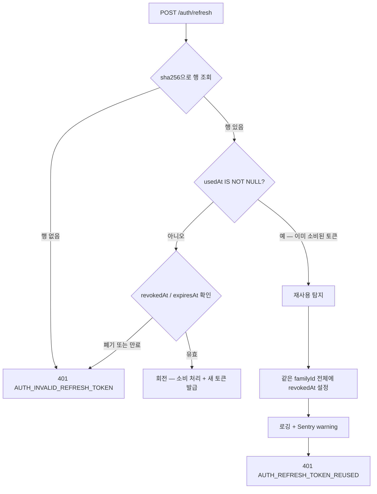
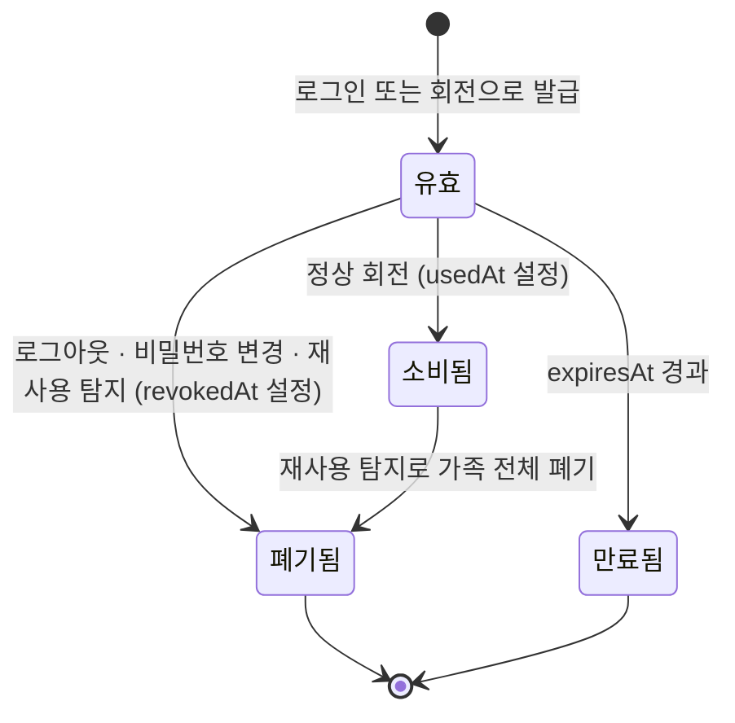

# 리프레시 토큰 — 회전 · 재사용 탐지 · 세션 폐기 (설계 스펙)

> 작성일: 2026-07-30
> 관련 결정: README 설계 결정 8(앱 계층 인가), 결정 7(DDD 레이어와 의존성 역전), 결정 13(Transactional Outbox의 트랜잭션 경계)
> 학습 노트: §6(인증·인가), §8(멱등성·정합성), §8.5(부하테스트가 rate limit에 막힌 사례), §8.6(Sentry에 무엇을 보낼지)

---

## 1. 목적과 범위

현재 인증은 액세스 토큰(JWT) 하나로만 동작합니다. 만료는 `JWT_EXPIRES_IN` 기본값인 1시간입니다(`src/auth/auth.module.ts`). 리프레시 토큰은 존재하지 않으며, `src/`·`prisma/schema.prisma`·`.env.example` 어디에도 관련 코드가 없습니다.

이 구조는 세 가지 문제를 만듭니다.

1. **1시간마다 재로그인이 필요합니다.** 토큰을 갱신할 경로가 `POST /auth/login` 외에 없습니다.
2. **탈취된 토큰을 폐기할 수 없습니다.** 서버가 상태를 갖지 않는 순수 JWT이므로, 만료까지 최대 1시간 동안 공격자가 그대로 사용합니다.
3. **로그아웃이 서버에 존재하지 않습니다.** 현재 로그아웃은 클라이언트가 쿠키를 버리는 것뿐이며, 서버는 그 사실을 모릅니다.

이번 작업은 리프레시 토큰을 도입해 위 세 문제를 다룹니다. 1순위 목표는 **보안 개념의 심화 학습**입니다. 회전(rotation)·재사용 탐지(reuse detection)·가족 단위 폐기 같은 상용 수준 정책을 직접 구현하며 이해하는 것이 목적이며, 따라서 "최소 비용으로 빨리"가 아니라 **"핵심 개념을 제대로 연습할 수 있는가"** 를 설계 판단 기준으로 삼습니다.

### 위협 모델 — 무엇을 방어하는가

| 위협 | 현재 | 도입 후 |
|---|---|---|
| 액세스 토큰 탈취 | 최대 1시간 유효, 폐기 불가 | 최대 15분 유효 |
| 리프레시 토큰 탈취 | 해당 없음 | 공격자가 사용하는 순간 가족 전체 폐기 |
| 로그아웃 | 클라이언트가 쿠키 버리기 | 서버가 실제로 폐기 |
| 비밀번호 유출 후 대응 | 비밀번호만 변경, 기존 세션 유지 | 전체 세션 폐기 |

**방어하지 못하는 것을 먼저 밝혀둡니다.** 액세스 토큰 자체의 즉시 폐기는 이번 범위에서 제공하지 않습니다. 폐기하려면 서버가 유효한 토큰 목록이나 블랙리스트를 들고 있어야 하는데, 그러면 JWT의 무상태(stateless) 검증 이점을 잃습니다. 액세스 토큰 수명을 15분으로 줄여 **피해 창을 좁히는 것**으로 대신하며, 최대 15분의 노출은 의도적으로 감수합니다.

### 범위에서 명시적으로 제외 (YAGNI)

**1. 유예 창(grace window)**

같은 리프레시 토큰이 짧은 시간(예: 10초) 안에 두 번 제출되면 탈취가 아닌 네트워크 재시도로 보고 통과시키는 장치입니다. 오탐을 줄이지만 탐지 정확도를 희생합니다.

제외하는 근거는 이 프로젝트의 클라이언트 구조입니다. 프론트엔드가 Next.js BFF(`web/app/api/session/route.ts`)이므로 갱신 요청은 서버 대 서버 1회 호출이고, 모바일 앱처럼 불안정한 네트워크에서 자동 재시도가 일어나는 구조가 아닙니다. 오탐 가능성은 한계(§12)로 기록하고, 모바일 클라이언트가 추가되면 재검토합니다.

**2. 만료된 토큰 행의 정리(cleanup)**

`expiresAt < now()` 인 행이 계속 쌓입니다. 이는 Outbox의 `PUBLISHED` 행 정리와 **동일한 문제**이며, 정리 방식(주기 배치 워커 / `pg_cron` / 조회 시 지연 삭제)이 그 자체로 별도 결정입니다. Outbox 정리와 함께 한 번에 다루는 편이 낫습니다.

**3. 액세스 토큰 블랙리스트**

즉시 폐기가 가능해지지만 무상태 검증 이점을 잃습니다. 위 위협 모델에서 설명한 트레이드오프입니다.

**4. 세션의 기기 식별 (`ip`·`userAgent` 저장)**

세션 목록에서 "어느 기기인지"를 보여주려면 IP와 User-Agent를 저장해야 합니다. **IP는 개인정보**입니다(GDPR·개인정보보호법 모두 식별자로 봅니다).

제외하는 근거는 이 프로젝트가 이미 내린 결정과의 일관성입니다. M10에서 Sentry를 붙일 때 관측성을 위해서도 `sendDefaultPii: false`를 두고 email을 PII로 보아 제외했습니다. 관측성에도 email을 넣지 않은 프로젝트가 세션 목록 UI를 위해 IP를 상시 적재하는 것은 앞뒤가 맞지 않습니다. 더구나 위 2번에서 정리 정책을 후속으로 미뤘으므로, IP를 쌓으면 **삭제 정책 없는 개인정보 축적**이 됩니다. 불투명 해시를 정리 없이 쌓는 것과는 위험의 성질이 다릅니다.

### 성공 기준

1. 액세스 토큰이 만료된 뒤에도 리프레시 토큰으로 재인증 없이 갱신된다
2. 갱신할 때마다 리프레시 토큰이 교체되고, 교체된 토큰은 다시 사용할 수 없다
3. 이미 사용된 리프레시 토큰이 제출되면 **그 로그인에서 파생된 모든 토큰이 폐기**되고, 전용 에러 코드와 Sentry 경고가 남는다
4. 로그아웃이 서버 상태를 바꾼다. 폐기된 세션으로는 갱신이 불가능하다
5. 비밀번호를 변경하면 해당 사용자의 모든 세션이 끊긴다
6. 사용자가 자신의 활성 세션 목록을 보고 개별적으로 끊을 수 있으며, 타인의 세션은 끊을 수 없다
7. DB에 리프레시 토큰 원문이 저장되지 않는다

### 용어

- **액세스 토큰(access token):** 매 API 요청에 실어 보내는 단기 인증 토큰. 이 프로젝트에서는 JWT이며 서버가 서명만 검증하고 상태를 조회하지 않습니다
- **리프레시 토큰(refresh token):** 액세스 토큰이 만료됐을 때 새 액세스 토큰을 받기 위한 장기 토큰. 갱신 경로에서만 사용됩니다
- **회전(rotation):** 리프레시 토큰을 사용할 때마다 새 토큰으로 교체하고 기존 토큰을 무효화하는 것. 유출된 토큰의 유효 기간을 "다음 갱신까지"로 줄입니다
- **가족(family):** 하나의 로그인에서 파생된 리프레시 토큰들의 계보. 회전으로 토큰이 바뀌어도 같은 가족에 속합니다. **가족 = 세션 = 로그인한 기기 하나**로 대응합니다
- **재사용 탐지(reuse detection):** 이미 회전으로 소비된 토큰이 다시 제출되는 것을 탈취 신호로 판단하는 것
- **불투명 토큰(opaque token):** 그 자체로는 아무 정보를 담지 않고, 서버가 저장소를 조회해야만 의미를 알 수 있는 토큰. JWT처럼 자기 완결적이지 않습니다
- **BFF(Backend For Frontend):** 프론트엔드 전용 중간 서버. 이 프로젝트에서는 Next.js 서버 라우트가 백엔드를 호출하고 브라우저에는 `httpOnly` 쿠키만 노출합니다

---

## 2. 토큰 형식과 저장 방식

### 2.1 리프레시 토큰은 불투명 랜덤 문자열

```typescript
crypto.randomBytes(32).toString('base64url'); // 256비트 엔트로피
```

JWT로 만들지 않습니다. 근거는 두 가지입니다.

첫째, 리프레시 토큰은 **어차피 매번 DB를 조회**합니다. 폐기 여부와 소비 여부를 확인해야 하므로 자기 완결적 클레임이 주는 이점(조회 없이 검증)이 성립하지 않습니다.

둘째, JWT로 만들면 **"폐기됐지만 서명은 유효한 토큰"** 이라는 상태가 생깁니다. 서명 검증만 통과한 토큰을 유효하다고 착각하는 실수가 나오기 쉬운 구조입니다. 불투명 토큰은 DB 조회 없이는 아무것도 판단할 수 없으므로 그런 우회가 원천적으로 불가능합니다.

액세스 토큰은 지금처럼 JWT를 유지합니다. 매 요청에서 상태 조회 없이 검증되어야 하므로 자기 완결성이 필요한 쪽입니다.

### 2.2 저장은 SHA-256 해시로

DB에는 원문을 저장하지 않고 `sha256(token)` 만 저장합니다. 검증은 들어온 토큰을 같은 방식으로 해시해 조회합니다.

**bcrypt를 쓰지 않는 근거를 분명히 해둡니다.** bcrypt는 저엔트로피 비밀번호를 무차별 대입에서 보호하기 위해 **의도적으로 느립니다**. 256비트 랜덤 토큰은 무차별 대입이 애초에 성립하지 않으므로 느릴 필요가 없습니다.

오히려 해롭습니다. M8 부하테스트에서 `POST /auth/login`의 p95가 114ms로 측정됐고, 읽기 경로(6.9ms)의 약 17배였습니다. 원인은 bcrypt가 CPU 바운드라는 점이었습니다(학습 노트 §8.5). 갱신 경로마다 bcrypt를 돌리면 **그 비용을 갱신 경로에 그대로 옮겨오게** 됩니다. 갱신은 로그인보다 자주 일어나는 경로이므로 영향이 더 큽니다.

해시 방식이 달라지는 이유를 표로 정리하면 다음과 같습니다.

| | 비밀번호 | 리프레시 토큰 |
|---|---|---|
| 엔트로피 | 낮음(사람이 만든 값) | 256비트(암호학적 난수) |
| 위협 | 유출된 해시의 오프라인 무차별 대입 | 성립하지 않음 |
| 필요한 성질 | 느릴수록 안전 | 빠를수록 좋음 |
| 선택 | bcrypt | SHA-256 |

---

## 3. 데이터 모델 (스키마 + 마이그레이션)

```prisma
model RefreshToken {
  id        String    @id @default(cuid())
  userId    String
  tokenHash String    @unique   // sha256(원문). 원문은 저장하지 않는다
  familyId  String              // 로그인 1회 = 가족 1개. 회전해도 유지된다
  expiresAt DateTime
  usedAt    DateTime?           // 회전으로 소비된 시각
  revokedAt DateTime?           // 폐기된 시각(로그아웃 또는 재사용 탐지)
  createdAt DateTime  @default(now())

  user User @relation(fields: [userId], references: [id], onDelete: Cascade)

  @@index([userId])
  @@index([familyId])
  @@index([expiresAt])
}
```

`User` 모델에 역방향 관계를 추가합니다.

```prisma
model User {
  // ... 기존 필드
  refreshTokens RefreshToken[]
}
```

### 상태를 enum이 아니라 nullable 타임스탬프로 표현하는 이유

`status: PENDING | USED | REVOKED` 같은 enum 대신 `usedAt`·`revokedAt`을 nullable로 둡니다.

이 레포가 이미 같은 방식을 씁니다. soft delete는 `deletedAt`(설계 결정 9), Outbox는 `publishedAt`·`failedAt`(설계 결정 13)으로 상태를 표현합니다. 일관성 외에 실질적 이점도 있습니다 — **"언제" 정보가 사후 조사의 근거**가 됩니다. 재사용 탐지가 발생했을 때 "이 가족이 언제 폐기됐는지"를 알 수 있어야 침해 시점을 추정할 수 있습니다.

### 토큰 유효 조건

```sql
usedAt IS NULL AND revokedAt IS NULL AND expiresAt > now()
```

세 조건이 각각 다른 상태를 배제합니다. `usedAt`은 이미 회전된 토큰, `revokedAt`은 폐기된 토큰, `expiresAt`은 만료된 토큰입니다. 이 셋을 구분해서 다루는 것이 §4의 재사용 탐지에서 핵심이 됩니다.

### 마이그레이션

`prisma migrate dev --name add_refresh_token` 으로 생성합니다. 기존 테이블 변경이 없는 순수 추가이므로 데이터 마이그레이션이 필요하지 않습니다. `onDelete: Cascade`는 사용자 물리 삭제 시 토큰도 함께 지우기 위한 것이지만, 이 레포는 `User`를 soft delete하므로(결정 9) 실제로는 발동하지 않습니다. 향후 물리 삭제를 도입할 때의 안전망으로 둡니다.

---

## 4. 회전과 재사용 탐지

### 4.1 정상 갱신 흐름

```text
1. POST /auth/refresh  { refreshToken }
2. sha256(refreshToken) 으로 행 조회
3. 유효성 확인 — usedAt IS NULL, revokedAt IS NULL, expiresAt > now()
4. 한 트랜잭션으로 두 가지를 함께 수행
     4-1. 기존 행에 usedAt = now()  (소비 처리)
     4-2. 새 토큰 발급 후 같은 familyId 로 새 행 INSERT
5. 새 accessToken 과 새 refreshToken 을 반환
```

**4번을 한 트랜잭션으로 묶는 것이 중요합니다.** 나누면 "기존 토큰은 소비 처리됐는데 새 토큰 INSERT가 실패한" 상태가 가능해지고, 그 사용자는 유효한 리프레시 토큰을 하나도 갖지 못해 재로그인해야 합니다. 두 쓰기의 원자성이 곧 사용자 세션의 연속성입니다.

이는 Outbox(설계 결정 13)에서 도메인 변경과 `OutboxEvent` 적재를 한 트랜잭션으로 묶은 것과 같은 판단입니다. 기존 `TRANSACTION_RUNNER` 포트(`src/outbox/domain/transaction-runner.ts`)를 그대로 사용합니다.

### 4.2 재사용 탐지 판정



핵심은 **`usedAt IS NOT NULL` 을 만나는 순간이 곧 침해 신호**라는 점입니다. 정상 클라이언트는 회전으로 교체된 토큰을 다시 사용할 이유가 없습니다. 그 토큰이 다시 온다면 누군가 사본을 갖고 있다는 뜻입니다.



### 4.3 탐지 시 가족 전체를 폐기하는 이유

같은 `familyId`의 모든 행에 `revokedAt`을 설정합니다. 그 결과 **정상 사용자도 함께 로그아웃됩니다.**

이는 버그가 아니라 의도된 동작입니다. 판단 근거는 **서버가 누가 진짜 사용자인지 구분할 수 없다**는 것입니다. 두 요청 모두 유효한 토큰을 제시했고, IP나 User-Agent를 저장하지 않으므로(§1의 제외 4번) 구별할 단서도 없습니다. 이 상황에서 선택지는 셋입니다.

| 선택 | 결과 |
|---|---|
| 둘 다 유지 | 공격자가 세션을 계속 유지 |
| 나중에 온 쪽만 거절 | 공격자가 먼저 갱신했다면 정상 사용자가 튕기고 공격자가 세션을 이어받음 |
| **가족 전체 폐기** | 둘 다 끊기고 재인증 필요. 공격자의 접근도 확실히 차단 |

세 번째를 택합니다. 재로그인 비용(사용자가 다시 로그인)이 세션 탈취 지속 비용보다 훨씬 작다는 판단입니다.

### 4.4 만료·폐기는 침해가 아니다

`revokedAt`이나 `expiresAt`으로 걸린 토큰은 **가족을 폐기하지 않습니다.** 만료는 정상적인 시간 경과이고, 이미 폐기된 토큰은 추가로 폐기할 것이 없습니다. 이 경우 그 요청만 `401`로 거절합니다.

이 구분을 흐리면 "만료된 토큰을 늦게 제출했다는 이유로 다른 기기까지 끊기는" 오작동이 됩니다.

### 4.5 동시 제출 경합 — compare-and-set

`findByHash`(4.1의 2단계)는 트랜잭션 밖에서 실행됩니다. 따라서 같은 리프레시 토큰이 거의 동시에 두 번 제출되면(네트워크 재시도, 이중 클릭 같은 정상 클라이언트의 중복 제출이거나, 공격자가 탈취 직후 원 사용자와 겹치는 시점에 사용하는 경우) 두 요청 모두 아직 `usedAt`이 채워지지 않은 같은 행을 읽고 4번(트랜잭션)까지 함께 진입합니다. 이 시점에는 아직 어느 쪽도 소비를 커밋하지 않았으므로 4.2의 `usedAt IS NOT NULL` 판정으로는 이 상황을 잡을 수 없습니다.

이를 막기 위해 `markUsed`(4.1의 4-1)를 조건부 갱신(compare-and-set)으로 구현합니다. `UPDATE ... WHERE id = ? AND usedAt IS NULL`처럼 갱신 조건에 `usedAt IS NULL`을 걸어, 먼저 커밋하는 요청만 갱신된 행 수 1을 받습니다. 늦게 도착한 요청은 그 시점에 이미 `usedAt`이 채워져 있어 조건에 걸리지 않고 행 수 0을 받는데, 이 0이 곧 "경합에서 졌다"는 신호입니다.

행 수가 0인 요청은 트랜잭션 콜백 안에서 `AUTH_REFRESH_TOKEN_REUSED`를 던져 즉시 롤백시킵니다 — 새 토큰을 남기지 않고 그 요청만 거절됩니다. **다만 이 경로는 가족을 폐기하지 않습니다.** 4.2·4.3의 재사용 탐지(이미 커밋되어 확정된 회전 이후의 재제출)와는 신호의 확실성이 다르기 때문입니다. 근거와 한계는 §14의 6번을 참고합니다.

---

## 5. 세션 폐기와 세션 목록

### 5.1 세션 = 가족

세션 하나가 가족 하나에 대응합니다. 로그인할 때 새 `familyId`를 만들고, 이후 회전은 그 값을 유지합니다.

- **세션의 로그인 시각** = 그 가족의 `MIN(createdAt)` (최초 발급 시점)
- **활성 세션** = 그 가족에 유효 조건(§3)을 만족하는 행이 하나라도 존재

### 5.2 세션 목록 — 개인정보 없이

```json
GET /auth/sessions
[
  { "familyId": "clx...", "createdAt": "2026-07-28T10:00:00.000Z", "current": true },
  { "familyId": "cly...", "createdAt": "2026-07-25T09:12:00.000Z", "current": false }
]
```

새 컬럼이 필요하지 않습니다. `familyId`·`createdAt`·`revokedAt`으로 전부 계산됩니다.

`current` 표시는 필수 기능입니다. 없으면 사용자가 목록에서 자기 세션을 알아볼 수 없고, 그 상태로 개별 폐기를 제공하면 **자기 세션을 실수로 끊게** 됩니다. 이를 위해 액세스 토큰에 `fam` 클레임을 추가합니다(§6).

**감수하는 것:** 사용자는 낯선 세션을 기기로 식별할 수 없습니다. "언제 로그인했는지"와 "지금 이 세션인지"만이 판단 근거입니다. IP·User-Agent를 저장하지 않기로 한 결정(§1의 제외 4번)의 대가입니다.

### 5.3 폐기 경로 세 가지

| 경로 | 폐기 범위 |
|---|---|
| `POST /auth/logout` | 제출한 리프레시 토큰이 속한 가족 |
| `POST /auth/logout-all` | 해당 사용자의 모든 가족 |
| `DELETE /auth/sessions/:familyId` | 지정한 가족 (본인 소유만) |

`DELETE /auth/sessions/:familyId`에는 **소유권 검사가 필수**입니다. 인증만 통과했다고 임의의 `familyId`를 받으면 타인의 세션을 끊을 수 있습니다. 이는 설계 결정 8(RBAC + 리소스 소유권 이중 인가)이 그대로 적용되는 지점입니다 — "역할만 보면 안 되고 이 리소스의 소유자인지까지 확인해야 한다"는 원칙이 세션에도 적용됩니다.

검사 방식: 조회한 가족의 `userId`가 요청자의 `sub`와 일치하는지 확인하고, 다르면 `403`으로 거절합니다. 존재하지 않는 `familyId`도 `403`으로 응답합니다 — `404`로 구분하면 남의 `familyId` 존재 여부를 알려주는 정보 노출이 됩니다.

### 5.4 비밀번호 변경 연계

`PATCH /auth/password` 성공 시 그 사용자의 **모든 가족을 폐기**합니다.

근거는 비밀번호를 변경하는 상황의 성격입니다. 대개 "유출됐을지도 모른다"는 판단에서 나오는 행동이므로, 기존 세션을 살려두면 공격자의 접근이 그대로 유지됩니다. 비밀번호만 바꾸고 세션을 남겨두는 것은 대응의 절반만 하는 것입니다.

**본인도 재로그인해야 합니다.** 새 토큰 쌍을 발급해 본인 세션만 이어주는 방식도 가능하지만 택하지 않습니다. 구현이 단순해지고, "비밀번호를 바꿨으니 다시 로그인하세요"는 사용자가 납득하는 흐름입니다.

`ChangePasswordUseCase`가 `RefreshTokenRepository`에 의존하게 되므로, 비밀번호 해시 갱신과 토큰 폐기를 **한 트랜잭션**으로 묶습니다. 나누면 "비밀번호는 바뀌었지만 기존 세션이 살아있는" 창이 생깁니다.

---

## 6. 액세스 토큰 payload 변경 (`fam` 클레임)

### 6.1 변경 내용

```typescript
// src/auth/domain/token-issuer.ts
export interface TokenPayload {
  sub: string;
  email: string;
  role: Role;
  fam: string; // 이 토큰이 파생된 리프레시 토큰 가족(= 세션) 식별자
}
```

### 6.2 근거

`GET /auth/sessions`가 `current`를 표시하려면, 요청에 실린 액세스 토큰이 **자기 출처 세션을 알고 있어야** 합니다. 현재 payload에는 그 정보가 없습니다.

개념적으로도 자연스러운 추가입니다. 모든 액세스 토큰은 특정 로그인에서 파생되므로 그 출처를 담는 것이 사실에 부합합니다. 회전해도 `fam`은 유지되므로 갱신 후에도 같은 세션으로 인식됩니다.

### 6.3 영향 범위

| 파일 | 변경 |
|---|---|
| `src/auth/domain/token-issuer.ts` | `TokenPayload`에 `fam` 추가 |
| `src/auth/infrastructure/jwt-token.service.ts` | 변경 없음 (payload를 그대로 서명) |
| `src/auth/interface/jwt.strategy.ts` | 변경 없음 (`validate`가 payload를 그대로 반환) |
| `src/auth/application/login.use-case.ts` | 리프레시 토큰 발급 후 그 `familyId`를 `fam`으로 전달 |
| `src/auth/application/kakao-login.use-case.ts` | 동일 |
| `src/auth/application/complete-kakao-signup.use-case.ts` | 동일 |
| `src/auth/application/refresh-tokens.use-case.ts` | 회전 시 기존 `familyId`를 유지해 전달 |

`jwt.strategy.ts`와 `jwt-token.service.ts`가 변경되지 않는 것은 둘 다 payload를 구조에 관여하지 않고 통과시키기 때문입니다. `@CurrentUser()`가 넘겨주는 객체에 `fam`이 자동으로 포함됩니다.

**발급 순서에 제약이 생깁니다.** 액세스 토큰이 `fam`을 담아야 하므로 **리프레시 토큰을 먼저 발급해 `familyId`를 확정한 뒤** 액세스 토큰을 발급해야 합니다. 세 로그인 유스케이스 모두 이 순서를 따릅니다.

### 6.4 기존 토큰과의 호환

배포 시점에 이미 발급된 액세스 토큰에는 `fam`이 없습니다. 이 토큰들은 만료(최대 1시간)까지 유효하며, 그 기간에 `GET /auth/sessions`를 호출하면 `current`를 판정할 수 없습니다.

처리 방식: `fam`이 없으면 모든 항목의 `current`를 `false`로 둡니다. 예외를 던지지 않습니다. 최대 1시간 뒤 자연히 해소되는 과도기 상태에 마이그레이션 로직을 두는 것은 과합니다.

---

## 7. API 계약

> CLAUDE.md의 "API 문서화" 규칙에 따라 README API 표도 함께 갱신합니다. 모든 신규·변경 엔드포인트에 Swagger 데코레이터가 필요합니다.

| 메서드·경로 | 기능 | 인가 |
|---|---|---|
| `POST /auth/login` | 응답에 `refreshToken` 추가 | 공개 |
| `POST /auth/kakao` | 기존 유저 응답에 `refreshToken` 추가 | 공개 |
| `POST /auth/kakao/complete` | 응답에 `refreshToken` 추가 | 공개(온보딩 토큰 보유) |
| `POST /auth/refresh` | 액세스·리프레시 토큰 갱신(회전) | 공개(리프레시 토큰 보유) |
| `POST /auth/logout` | 현재 세션(가족) 폐기 | 공개(리프레시 토큰 보유) |
| `POST /auth/logout-all` | 내 모든 세션 폐기 | 인증 |
| `GET /auth/sessions` | 내 활성 세션 목록 | 인증(본인) |
| `DELETE /auth/sessions/:familyId` | 특정 세션 폐기 | 인증 + 해당 가족 소유자 |
| `PATCH /auth/password` | 비밀번호 변경 + 전체 세션 폐기 | 인증(본인) |

### `/auth/refresh`와 `/auth/logout`이 공개인 이유

두 경로는 **액세스 토큰이 이미 만료된 상태에서 호출**됩니다. `JwtAuthGuard`를 걸면 갱신 자체가 불가능해집니다. 리프레시 토큰 자체가 인증 수단이며, 요청 바디의 토큰이 유효하지 않으면 `401`로 거절됩니다.

### 토큰 전달은 응답 바디

백엔드는 `Set-Cookie`를 사용하지 않습니다.

```
POST /auth/refresh  { refreshToken }  →  { accessToken, refreshToken }
```

Next.js BFF가 응답 바디에서 두 토큰을 받아 각각 `httpOnly` 쿠키로 심습니다. 현재 `web/lib/session.ts`의 `setSession(accessToken)`을 확장하는 형태입니다.

근거는 레이어 경계입니다. 백엔드 `interface` 레이어는 transport만 담당하고, 쿠키·`SameSite`·도메인·`Path` 같은 **표현 계층 관심사는 BFF가 갖는** 것이 결정 7(레이어 단방향)과 맞습니다. 백엔드가 쿠키를 심으면 CORS·도메인 설정을 알아야 하고 BFF와 역할이 겹칩니다. 부수 이점으로, 모바일 앱 같은 다른 클라이언트가 붙어도 같은 계약이 그대로 동작합니다.

### 에러 코드 (`src/auth/auth.errors.ts` 에 2개 추가)

| code | status | 의미 |
|---|---|---|
| `AUTH_INVALID_REFRESH_TOKEN` | 401 | 존재하지 않거나 만료·폐기된 리프레시 토큰 |
| `AUTH_REFRESH_TOKEN_REUSED` | 401 | 이미 소비된 토큰의 재제출 — 침해 의심 |
| `AUTH_NOT_SESSION_OWNER` | 403 | 자신의 세션이 아닌 `familyId` 폐기 시도 |

**앞의 두 코드를 분리하는 근거:** 전자는 흔하게 발생하는 만료이고, 후자는 조사가 필요한 보안 사건입니다. 같은 코드로 뭉치면 **침해 신호가 만료 노이즈에 묻힙니다.** HTTP status는 둘 다 401로 같게 두어 공격자에게 내부 상태를 알려주지 않습니다.

**`AUTH_NOT_SESSION_OWNER`를 신설하는 근거:** 기존 `AUTH_INSUFFICIENT_ROLE`(403)을 재사용하지 않습니다. 역할이 부족한 것이 아니라 **소유권이 없는 것**이므로 의미가 다릅니다. 이 레포는 이미 소유권 위반에 전용 코드를 씁니다 — `PROPERTY_NOT_BUILDING_OWNER`, `BOARD_NOT_AUTHOR`가 같은 계열입니다. 세션에도 같은 결을 유지합니다.

존재하지 않는 `familyId`도 이 코드로 응답합니다(§5.3). `404`로 구분하면 남의 `familyId` 존재 여부를 알려주는 정보 노출이 됩니다.

---

## 8. Config (하드코딩 금지 — ConfigKey + .env.example)

| 키 | 기본값 | 근거 |
|---|---|---|
| `JWT_EXPIRES_IN` | `1h` → **`15m`** | 액세스 토큰 탈취 피해 창 축소. 리프레시 토큰 도입의 실질적 이유 |
| `REFRESH_TOKEN_TTL_DAYS` | `14` | 2주면 일상 사용에서 재로그인이 드물다 |
| `REFRESH_TOKEN_BYTES` | `32` | 256비트 엔트로피 |

`src/config/config-keys.ts`의 `ConfigKey` enum과 `.env.example`에 함께 등록합니다(CLAUDE.md 규칙).

### 액세스 토큰 단축이 이번 작업의 핵심 중 하나

액세스 토큰을 1시간으로 두면 리프레시 토큰을 도입해도 **보안상 얻는 것이 거의 없습니다.** 짧은 액세스 토큰과 회전하는 리프레시 토큰은 한 세트입니다. 짧은 수명이 만드는 불편(자주 만료됨)을 리프레시 토큰이 해소하고, 리프레시 토큰이 감당하는 위험을 회전과 재사용 탐지가 줄입니다.

### 프론트엔드 후속 작업

`web/lib/session.ts`의 쿠키 `maxAge`가 `60 * 60`(1시간)이고 "access token 수명에 맞춰 후속 조정"이라는 주석이 이미 달려 있습니다. 액세스 토큰 쿠키는 15분, 리프레시 토큰 쿠키는 14일로 맞춰야 합니다. BFF에 갱신 호출 로직도 추가해야 합니다 — 별도 작업으로 분리합니다.

---

## 9. Rate limit

| 경로 | 한도 |
|---|---|
| `POST /auth/refresh` | **라우트별 override 없음** — 전역 기본값(user 60 / IP 120 per min) |
| `POST /auth/logout` | 기본 한도 |
| `POST /auth/logout-all` | 기본 한도 |
| `DELETE /auth/sessions/:familyId` | 기본 한도 |

`/auth/refresh`는 공개 엔드포인트이므로 한도가 필요합니다. 다만 **목적은 토큰 추측 방어가 아닙니다** — 256비트 랜덤을 맞히는 무차별 대입은 성립하지 않습니다. 실제 목적은 **자원 보호**입니다. 갱신은 DB 조회와 쓰기를 동반하므로 무제한 호출은 그 자체로 부하입니다.

### M8의 교훈 — 라우트별 override를 두지 않는 이유

M7·M8 부하테스트에서 login 부하의 약 99%가 429로 막혀 순수 성능을 측정할 수 없었습니다. 원인은 `POST /auth/login`의 `@RateLimit({ ipMax: 10 })`이 데코레이터에 하드코딩되어 `RATE_LIMIT_*` env 상향으로 풀리지 않았다는 점입니다(학습 노트 §8.5).

이 문제의 뿌리는 가드의 우선순위입니다.

```typescript
// src/common/rate-limit/rate-limit.guard.ts
const userMax =
  override?.userMax ??
  this.intConfig(ConfigKey.RateLimitUserMax, DEFAULT_USER_MAX);
```

**라우트별 override가 env보다 항상 우선합니다.** 따라서 한도를 상수 파일로 추출해도 이 문제는 해결되지 않습니다 — 값을 찾기 쉬워질 뿐이고, env로 완화하는 경로는 여전히 막혀 있습니다.

그래서 `/auth/refresh`에는 **라우트별 override를 두지 않고** 전역 기본값(`DEFAULT_USER_MAX = 60`, `DEFAULT_IP_MAX = 120`)을 그대로 씁니다. 근거는 두 가지입니다.

1. **기본값이 충분합니다.** 갱신은 유효한 리프레시 토큰이 있어야 하므로 게시글 작성 같은 스팸 표면이 아닙니다. 분당 60회는 정상 사용에서 도달하지 않는 한도이며, 자원 보호 목적에는 부합합니다
2. **env로 조정 가능한 상태를 유지합니다.** 나중에 갱신 경로를 부하테스트할 때 `RATE_LIMIT_USER_MAX` 상향으로 풀 수 있습니다. M8에서 login으로 겪은 막힘을 반복하지 않습니다

라우트별로 더 조여야 할 근거가 실측으로 나오면 그때 override를 추가합니다. 그 시점에는 "env로 못 푼다"는 비용을 알고 선택하는 것이므로 문제가 되지 않습니다.

> **후속 과제로 분리:** 가드의 우선순위를 `override ?? env`에서 "env가 명시되면 env 우선"으로 바꾸면 login의 하드코딩 문제도 함께 풀립니다. 다만 이는 전역 가드의 동작 변경이고 기존 라우트 4곳에 영향을 주므로 이번 범위에서 다루지 않습니다.

---

## 10. 레이어 배치 (DDD)

기존 auth 컨텍스트의 레이어 규칙을 그대로 따릅니다.

```
src/auth/
  domain/
    refresh-token.entity.ts          불변식 — 유효성 판정, 소비, 폐기
    refresh-token.repository.ts      포트(Symbol 토큰)
    refresh-token-generator.ts       포트 — 랜덤 생성 + 해시
  application/
    refresh-tokens.use-case.ts       갱신 + 회전 + 재사용 탐지
    logout.use-case.ts               가족 폐기
    logout-all.use-case.ts           전체 폐기
    list-sessions.use-case.ts        세션 목록
    revoke-session.use-case.ts       개별 폐기(소유권 검사)
  infrastructure/
    prisma-refresh-token.repository.ts
    crypto-refresh-token-generator.ts    node:crypto
  interface/
    auth-rate-limit.constants.ts
    dto/refresh.dto.ts, dto/session.dto.ts
```

### `randomBytes`·`createHash`를 포트 뒤로 감추는 이유

도메인과 애플리케이션이 암호 구현을 모르게 합니다(결정 7의 의존성 역전). 실질적 이점은 테스트입니다 — 유스케이스 테스트에서 생성기를 결정적 값을 반환하는 가짜로 갈아끼우면 "어떤 토큰이 발급됐는가"를 단정할 수 있습니다. 난수를 직접 호출하면 그게 불가능합니다.

기존 `PasswordHasher` 포트(`src/auth/domain/password-hasher.ts`)가 bcrypt를 감싸는 것과 같은 패턴입니다.

### `TokenIssuer`를 확장하지 않고 별도 포트로 분리하는 이유

리프레시 토큰 발급을 기존 `TokenIssuer`에 메서드로 추가하지 않습니다. 두 토큰은 **수명·형식·저장 방식·검증 방식이 전부 다릅니다.**

| | 액세스 토큰 | 리프레시 토큰 |
|---|---|---|
| 형식 | JWT | 불투명 랜덤 |
| 수명 | 15분 | 14일 |
| 저장 | 저장하지 않음 | DB에 해시 저장 |
| 검증 | 서명만 | DB 조회 |

한 인터페이스에 묶으면 구현체가 JWT 서비스와 DB 저장을 동시에 알아야 하고, 응집도가 떨어집니다.

---

## 11. 테스트 (TDD)

CLAUDE.md의 NestJS 테스트 규칙을 따릅니다. 유스케이스는 포트를 mock으로 대체한 순수 단위 테스트이며, `as any` 대신 `Partial<jest.Mocked<T>>`를 쓰고 AAA 패턴을 지키며 매직값은 상수로 추출합니다.

| # | 케이스 | 확인할 것 |
|---|---|---|
| 1 | 정상 회전 | 기존 토큰에 `usedAt` 설정, 새 토큰이 **같은 `familyId`** |
| 2 | **재사용 탐지** | `usedAt` 있는 토큰 제출 시 가족 전체 `revokedAt` + `AUTH_REFRESH_TOKEN_REUSED` |
| 3 | 만료 토큰 | 401, **가족은 폐기하지 않음**(침해가 아니므로) |
| 4 | 폐기된 토큰 | 401, 추가 폐기 없음 |
| 5 | 존재하지 않는 토큰 | 401, DB 변경 없음 |
| 6 | 회전 원자성 | 새 토큰 INSERT 실패 시 기존 토큰의 `usedAt`도 롤백 |
| 7 | 로그아웃 | 같은 가족만 폐기, 다른 가족은 유효 유지 |
| 8 | 전체 로그아웃 | 해당 사용자의 모든 가족 폐기 |
| 9 | 비밀번호 변경 | 전체 가족 폐기. 해시 갱신과 폐기가 같은 트랜잭션 |
| 10 | 세션 목록 | 가족별 1건으로 묶임. 폐기·만료된 가족 제외 |
| 11 | `current` 표시 | 요청 토큰의 `fam`과 일치하는 항목만 `true` |
| 12 | `fam` 없는 구 토큰 | 예외 없이 전부 `current: false` |
| 13 | **타인 세션 폐기 시도** | 403. 남의 `familyId`로 요청하면 거절 |
| 14 | 존재하지 않는 familyId 폐기 | 403 (404로 존재 여부를 노출하지 않음) |
| 15 | 회전 후 `current` 유지 | 갱신해도 같은 가족이므로 `current`가 유지됨 |
| 16 | **해시 저장 검증** | 저장된 `tokenHash`가 원문과 다르고, `sha256(원문)`과 일치 |
| 17 | 로그인 시 발급 순서 | 리프레시 토큰이 먼저 발급되고 그 `familyId`가 액세스 토큰 `fam`에 담김 |

16번을 명시적으로 두는 이유: 원문 저장은 **조용히 발생하는 사고**입니다. 동작은 정상이므로 다른 테스트가 잡지 못합니다. 테스트로 못박아야 합니다.

2번과 3번을 나란히 두는 이유: 이 둘의 차이가 이번 설계의 핵심입니다. "무효한 토큰"과 "침해 신호"를 구분하지 못하면 오작동이 됩니다.

---

## 12. 관측 (로깅 + Sentry)

재사용 탐지는 `logger.warn`으로 남기고 Sentry에 `level=warning`으로 캡처합니다. 포함할 컨텍스트는 `userId`, `familyId`, 탐지 시각입니다. **토큰 원문이나 해시는 로그에 남기지 않습니다.**

### M10 결정과의 관계

M10에서 4xx는 원칙적으로 Sentry에 보내지 않기로 했습니다. 개별 4xx는 사용자발(만료 토큰·오타)이 섞여 노이즈이기 때문입니다.

`AUTH_REFRESH_TOKEN_REUSED`는 그 예외입니다. 사용자 실수로는 발생할 수 없고, 발생했다면 토큰 사본이 존재한다는 뜻입니다. 이는 M12에서 "조용히 실패하는 서킷 브레이커를 금지"한 것과 같은 원칙입니다 — **보안 사건은 눈에 보이는 방식으로 기록되어야 합니다.**

`AUTH_INVALID_REFRESH_TOKEN`은 Sentry로 보내지 않습니다. 만료는 정상적인 일상입니다.

---

## 13. 단계별 검증

각 단계가 독립적으로 검증 가능하도록 끊습니다.

| 단계 | 내용 | 검증 |
|---|---|---|
| 1 | 스키마 + 마이그레이션 | `migrate dev` 성공, `migrate diff --exit-code` 통과 |
| 2 | 도메인 엔티티 + 포트 | 유효성 판정·소비·폐기 단위 테스트 (케이스 1~5) |
| 3 | 생성기 인프라 | 해시 저장 검증 (케이스 16) |
| 4 | Prisma repository | 가족 단위 조회·폐기 동작 |
| 5 | 갱신 유스케이스 | 회전 + 재사용 탐지 + 원자성 (케이스 1~6) |
| 6 | `fam` 클레임 배선 | 발급 순서와 payload (케이스 17) |
| 7 | 로그아웃 · 전체 로그아웃 | 케이스 7~8 |
| 8 | 비밀번호 변경 연계 | 케이스 9 |
| 9 | 세션 목록 · 개별 폐기 | 케이스 10~15 |
| 10 | 컨트롤러 + Swagger + rate limit | 엔드포인트 수동 확인, `/docs` 노출 |
| 11 | 액세스 토큰 15분 전환 | 만료 후 갱신이 동작하는지 |

---

## 14. 한계 (정직한 기록)

1. **액세스 토큰의 즉시 폐기가 불가능합니다.** 최대 15분 창이 남습니다. 블랙리스트로 해소할 수 있지만 JWT의 무상태 이점을 잃습니다
2. **만료된 토큰 행이 정리되지 않습니다.** Outbox의 `PUBLISHED` 행 정리와 함께 다룰 후속 과제입니다
3. **유예 창이 없어 오탐이 가능합니다.** 같은 리프레시 토큰으로 두 번 요청이 가면 재사용으로 판단합니다. 웹 BFF 구조에서는 위험이 낮지만, 모바일 클라이언트가 추가되면 재검토가 필요합니다
4. **세션을 기기로 식별할 수 없습니다.** IP·User-Agent를 저장하지 않기로 한 결정의 대가입니다. 사용자는 로그인 시각으로만 낯선 세션을 판단합니다
5. **재사용 탐지가 정상 사용자를 함께 끊습니다.** 의도된 동작이지만 사용자 경험 측면의 비용입니다
6. **동시 제출 경합(§4.5)의 패자는 `REFRESH_TOKEN_REUSED`로 거절되지만 가족은 폐기되지 않습니다.** 진 쪽 요청은 트랜잭션 안에서 예외를 던져 롤백되므로, 그 안에서 `revokeFamily`를 호출해도 함께 롤백되어 효과가 없습니다. 트랜잭션 밖에서 별도로 폐기할 수도 있지만 택하지 않았습니다 — 이 경합은 4.2·4.3의 재사용 탐지(이미 확정된 회전 이후의 재제출, 사본 존재가 확실한 신호)와 달리 **공격 경합인지 정상 클라이언트의 중복 제출인지 서버가 구분할 근거가 없습니다.** IP·User-Agent를 저장하지 않기로 했으므로(§1의 제외 4번) 구분 단서도 없습니다. 이 상황에서 가족을 폐기하면 정상 사용자의 중복 제출을 공격으로 오인해 모든 기기를 로그아웃시키는 UX 회귀가 됩니다.

   **감수하는 한계:** 경합의 승자가 실제 공격자이고 패자(정상 사용자)가 401을 받은 뒤 그 토큰을 재제출하지 않으면, 탈취가 영원히 탐지되지 않고 공격자의 세션이 그대로 유지됩니다. 이는 §1이 유예 창(grace window)을 범위에서 제외하며 감수한 것과 반대 방향의 트레이드오프입니다 — 유예 창은 "항상 재사용으로 판정"을 택해 오탐(정상 재시도를 공격으로 오판) 위험을 감수했지만, 이 경합 구간은 반대로 "항상 폐기하지 않음"을 택해 미탐(공격을 놓칠) 위험을 감수합니다. 다만 적용 범위는 좁습니다 — 두 요청의 `markUsed` 커밋이 밀리초 단위로 겹치는 구간에만 해당하며, 그 구간을 벗어난 재사용(승자 커밋 이후의 재제출)은 §4.2의 확정 탐지로 여전히 완전히 잡힙니다.

---

## 15. 트레이드오프 메모 (학습 포인트)

- **해시 알고리즘은 위협 모델이 결정합니다.** bcrypt가 비밀번호에 옳고 리프레시 토큰에 틀린 이유는, 두 값의 엔트로피가 다르고 따라서 방어할 위협이 다르기 때문입니다. "해시는 bcrypt"라는 관행을 그대로 적용하면 갱신 경로에 불필요한 CPU 비용을 얹습니다
- **원자성이 사용자 경험을 결정합니다.** 회전의 두 쓰기를 나누면 그 틈이 곧 강제 로그아웃입니다. Outbox의 dual-write와 구조가 같습니다 — 두 쓰기를 묶지 못하면 중간 실패가 사용자에게 드러납니다
- **탐지에는 대응 정책이 따라옵니다.** "탈취를 감지했다"만으로는 아무 일도 일어나지 않습니다. 가족 폐기라는 대응을 정의해야 탐지가 의미를 갖고, 그 대응은 정상 사용자를 끊는 비용을 동반합니다. 보안 결정이 공짜인 경우는 드뭅니다
- **에러 코드 설계가 관측 품질을 좌우합니다.** 만료와 재사용을 같은 코드로 뭉치면 Sentry에서 침해 신호를 찾을 수 없습니다. 코드를 나누는 판단은 API 계약이 아니라 **운영 관측**을 위한 것입니다
- **PII를 안 받으면 기능이 줄어듭니다.** 세션 목록에서 기기 식별을 포기한 것은 개인정보를 저장하지 않은 대가입니다. 프라이버시와 기능성의 교환이며, 어느 쪽이 정답이라기보다 무엇을 감수할지 정하는 문제입니다
